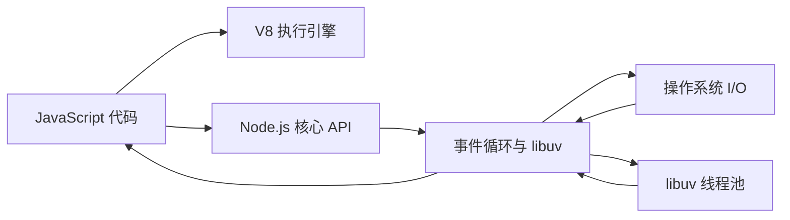
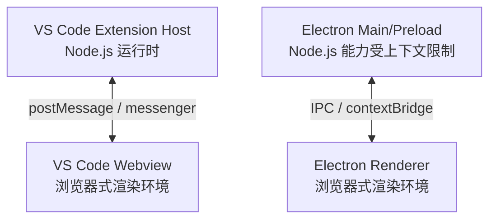
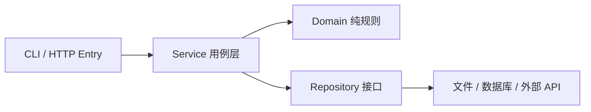

# Node.js 从小白到能独立开发：学习与能力强化指南

> 适用对象：会一点 JavaScript/TypeScript，但还不能独立完成 Node.js 项目的初学者。
>
> 学习目标：理解 Node.js 的运行方式，能写 CLI、文件处理工具和 HTTP 服务，能处理异步、错误、测试、调试、安全和部署问题。
>
> 文档更新时间：2026-08-13。示例以 Node.js 22+ 为基线；生产项目优先使用 Node.js 官方 LTS。当前仓库实测环境为 Node.js v22.23.1、npm 10.9.8。

---

## 0. 先建立正确的学习目标

Node.js 不是一门新的编程语言，而是一个让 JavaScript 可以在浏览器之外运行的运行时。真正的 Node.js 开发能力，不是背诵 `fs`、`http` 的方法名，而是能够完成下面这条链路：

```text
需求分析 → 数据与模块设计 → 异步流程 → 输入校验 → 错误处理
        → 测试 → 调试 → 性能与安全检查 → 可重复构建与交付
```

学完本指南，你应该能够回答并实践：

- Node.js 和浏览器 JavaScript 有什么区别？
- 为什么 Node.js 适合 I/O 密集型任务，但不适合直接执行很重的 CPU 计算？
- `Promise.all()` 什么时候可以用，什么时候会造成问题？
- ESM 和 CommonJS 如何选择？`package.json` 的 `type` 有什么作用？
- 大文件为什么要使用 Stream，而不是一次性 `readFile`？
- `npm install` 和 `npm ci` 有什么区别？
- 一个 HTTP 请求从进入到返回，应该经过哪些层？
- 如何让 Node.js 服务在关闭前完成正在处理的请求？
- 当前仓库里的 Extension Host、Electron Main、Webview，哪些地方可以使用 Node API？

### 推荐学习方法

每一节都按照四步学习：

1. 先读“为什么”，不要急着记 API。
2. 手动运行代码，观察输出和错误。
3. 故意改坏一个地方，再用日志、断点或测试定位问题。
4. 把示例改成自己的业务需求，并写一个测试证明它仍然正确。

如果只复制代码而不做第 3、4 步，通常只能获得“看懂教程”的能力，不能获得“独立开发”的能力。

### 目录

- [1. Node.js 到底是什么](#1-nodejs-到底是什么)
- [2. 开始前需要补齐的 JavaScript 基础](#2-开始前需要补齐的-javascript-基础)
- [3. 安装、运行与第一个 Node 程序](#3-安装运行与第一个-node-程序)
- [4. 模块系统：ESM 与 CommonJS](#4-模块系统esm-与-commonjs)
- [5. `process`、命令行参数和环境变量](#5-process命令行参数和环境变量)
- [6. 异步编程：Node.js 能力的分水岭](#6-异步编程nodejs-能力的分水岭)
- [7. 文件系统、路径和 JSON](#7-文件系统路径和-json)
- [8. Stream：处理大数据的关键能力](#8-stream处理大数据的关键能力)
- [9. 用原生 `http` 写一个最小 API](#9-用原生-http-写一个最小-api)
- [10. 错误处理：让失败可定位、可恢复、可测试](#10-错误处理让失败可定位可恢复可测试)
- [11. npm 与项目工程化](#11-npm-与项目工程化)
- [12. TypeScript Node 项目：从能跑到可维护](#12-typescript-node-项目从能跑到可维护)
- [13. 测试：把“我觉得能跑”变成证据](#13-测试把我觉得能跑变成证据)
- [14. 调试与排错方法](#14-调试与排错方法)
- [15. 安全与性能底线](#15-安全与性能底线)
- [16. 一个可维护的 Node 项目结构](#16-一个可维护的-node-项目结构)
- [17. 实战项目：Node Task Service](#17-实战项目node-task-service)
- [18. 常见错误与改进方案](#18-常见错误与改进方案)
- [19. 开发能力强化清单](#19-开发能力强化清单)
- [20. 高频问答：用来检查是否真正理解](#20-高频问答用来检查是否真正理解)
- [21. 14 天学习安排](#21-14-天学习安排)
- [22. 最终验收：你是否已经会用 Node.js](#22-最终验收你是否已经会用-nodejs)
- [23. 官方资料与继续学习](#23-官方资料与继续学习)

---

## 1. Node.js 到底是什么

### 1.1 一句话理解

Node.js 是一个跨平台 JavaScript 运行时。它使用 V8 执行 JavaScript，并提供文件系统、网络、进程、流、加密等服务器和系统能力。

浏览器里的 JavaScript 主要操作页面和浏览器提供的 Web API；Node.js 里的 JavaScript 主要操作操作系统资源和服务端能力。

### 1.2 浏览器和 Node.js 的区别

| 对比项 | 浏览器 JavaScript | Node.js JavaScript |
| --- | --- | --- |
| 运行环境 | 浏览器标签页 | 操作系统上的 Node 进程 |
| 页面 DOM | 通常可以使用 `document`、`window` | 默认没有 DOM |
| 文件访问 | 受浏览器安全模型限制 | 可通过 `node:fs` 访问文件，但必须注意权限与安全 |
| 网络能力 | `fetch`、WebSocket 等 | `http`、`https`、`fetch`、TCP、UDP 等 |
| 模块 | 浏览器 ESM、打包器 | ESM、CommonJS、Node 内置模块、npm 包 |
| 进程能力 | 不能直接管理操作系统进程 | `process`、`child_process`、Worker Threads |
| 常见任务 | 页面交互、渲染、用户输入 | API、CLI、构建工具、脚本、桌面应用主进程 |

### 1.3 运行模型：单线程不等于只有一个线程

最容易被误解的一句话是“Node.js 是单线程的”。更准确的说法是：

- JavaScript 回调通常在一个主线程上的事件循环中执行。
- I/O 等待会交给操作系统或 Node.js 底层机制处理。
- 部分文件系统、加密、DNS 等工作会使用 libuv 线程池。
- CPU 密集任务仍可能长时间占用 JavaScript 主线程，阻塞其他请求。
- 如果确实需要并行计算，可以考虑 Worker Threads、子进程或拆分服务。



Node.js 官方对它的核心优势描述为：通过异步 I/O 原语，避免 JavaScript 代码在等待文件、网络或数据库时一直阻塞。这里的“异步”并不意味着业务代码可以忽略顺序、错误和资源限制；你仍然要设计并发度、超时和取消。

### 1.4 什么时候适合使用 Node.js

比较适合：

- HTTP API、BFF、网关、实时通信服务。
- CLI、代码生成器、构建工具、自动化脚本。
- 文件转换、日志处理、数据导入导出等 I/O 密集型工具。
- VS Code Extension Host、Electron Main/Preload 等桌面应用侧能力。

需要谨慎：

- 大量图片/视频编码、复杂科学计算、长时间同步循环。
- 单个请求需要持续占用 CPU 的任务。

“不适合”不是绝对不能做，而是要通过 Worker Threads、子进程、队列或独立计算服务把重 CPU 工作移出请求主路径。

---

## 2. 开始前需要补齐的 JavaScript 基础

Node.js 学习会暴露 JavaScript 基础薄弱的问题。至少掌握下面这些内容：

### 必须会

- `const`、`let`、作用域、闭包。
- 原始类型、对象、数组、`null`、`undefined`。
- 解构、展开运算符、可选链 `?.`、空值合并 `??`。
- 函数、箭头函数、回调、高阶函数。
- `map`、`filter`、`find`、`reduce`、`for...of`。
- `throw`、`try/catch/finally`。
- Promise、`async/await`、`Promise.all`。
- ESM 的 `import/export`。

### 先理解再记忆

```js
const user = {
  id: 1,
  profile: { name: '小明' },
};

const name = user.profile?.name ?? '未命名';
const copy = { ...user, active: true };

console.log(name, copy);
```

这里的重点不是语法本身，而是理解：对象展开是浅拷贝；可选链只保证访问路径不因 `null/undefined` 直接报错；`??` 只在左侧为 `null/undefined` 时使用默认值。

### 入门自测

不看资料完成下面任务，再开始 Node 学习会更顺利：

1. 写一个函数，把一组订单按状态分组。
2. 写一个异步函数，顺序读取两个文件并合并结果。
3. 用 `Promise.all` 并发读取三个互不依赖的资源。
4. 解释 `forEach(async () => {})` 为什么不能被 `await` 等待。
5. 说出浅拷贝和深拷贝在嵌套对象上的差异。

---

## 3. 安装、运行与第一个 Node 程序

### 3.1 检查环境

```bash
node --version
npm --version
```

学习时建议使用一个仍在支持周期内的 LTS 版本。不要把教程中的版本号当成永久不变的事实；每次开始新项目时，查看 [Node.js 官方发布页](https://nodejs.org/en/about/previous-releases)。

### 3.2 直接运行 JavaScript

新建 `hello.js`：

```js
console.log('Hello Node.js');
console.log('进程号:', process.pid);
console.log('当前工作目录:', process.cwd());
```

运行：

```bash
node hello.js
```

这里要区分两个路径：

- `process.cwd()`：你执行命令时所在的目录，可能变化。
- `import.meta.url` 或 `__dirname`：当前模块文件所在的位置，取决于模块系统。

不要默认认为“当前工作目录就是当前脚本目录”。CLI 被其他目录调用时，这个假设很容易出错。

### 3.3 REPL 和常用命令

```bash
node                 # 进入交互式 REPL
node -e "console.log(1 + 2)"
node --help
node --watch src/index.js
node --inspect-brk src/index.js
```

`--watch` 适合学习和本地开发；生产环境需要更明确的进程管理、日志和退出策略。

### 3.4 第一个项目

```bash
mkdir node-learning
cd node-learning
npm init -y
mkdir src
```

建议从一开始就明确模块格式。在本指南中，普通 `.js` 文件使用 ESM：

```json
{
  "name": "node-learning",
  "version": "0.1.0",
  "private": true,
  "type": "module",
  "engines": {
    "node": ">=22"
  },
  "scripts": {
    "start": "node src/index.js",
    "dev": "node --watch src/index.js",
    "test": "node --test"
  }
}
```

`package.json` 是项目说明书，通常至少承担这些职责：

- 记录项目名称、版本和模块类型。
- 记录运行时依赖和开发依赖。
- 定义 `start`、`dev`、`test`、`build` 等统一命令。
- 通过 `engines` 表达最低 Node.js 版本。

---

## 4. 模块系统：ESM 与 CommonJS

Node.js 同时支持两套模块系统：

- ESM：`import` / `export`，现代 JavaScript 标准。
- CommonJS：`require` / `module.exports`，Node.js 早期生态中大量存在。

### 4.1 ESM 示例

`src/math.js`：

```js
export function add(a, b) {
  return a + b;
}

export function multiply(a, b) {
  return a * b;
}
```

`src/index.js`：

```js
import { add, multiply } from './math.js';

console.log(add(2, 3));
console.log(multiply(2, 3));
```

在 ESM 中，导入本地文件时通常写清扩展名：`./math.js`。导入 Node 内置模块时使用 `node:` 前缀：

```js
import { readFile } from 'node:fs/promises';
import path from 'node:path';
```

`node:` 前缀能明确表达“这是 Node 内置模块”，也可以避免和第三方包或项目文件混淆。

### 4.2 CommonJS 示例

`legacy.cjs`：

```js
const path = require('node:path');

module.exports = {
  join: path.join,
};
```

`use-legacy.cjs`：

```js
const { join } = require('./legacy.cjs');

console.log(join('a', 'b'));
```

### 4.3 如何选择

新项目建议统一一种格式。你当前的 TypeScript/现代前端项目更适合优先理解 ESM；遇到旧包时，再学习 CJS 互操作。

记住这几个规则：

- `.mjs` 明确是 ESM。
- `.cjs` 明确是 CommonJS。
- `.js` 如何解释，受最近的 `package.json` 中的 `type` 影响。
- 不要在同一个项目里无意识地混用 `import`、`require`、默认导出和命名导出。

### 4.4 模块边界的好习惯

一个模块应该有清晰的输入、输出和责任：


```js
// user-service.js
export function createUserService(userRepository) {
  return {
    async getUser(id) {
      if (!id) {
        throw new Error('id is required');
      }
      return userRepository.findById(id);
    },
  };
}
```

这个服务不关心数据来自 JSON 文件、SQLite 还是远程 API，所以可以独立测试。

---

## 5. `process`、命令行参数和环境变量

### 5.1 读取命令行参数

`process.argv` 的前两项通常是 Node 可执行文件和入口脚本，业务参数从 `slice(2)` 开始：

```js
const args = process.argv.slice(2);
const [command, ...values] = args;

if (command === 'hello') {
  console.log(`你好，${values[0] ?? '朋友'}`);
} else {
  console.error('用法: node src/cli.js hello <name>');
  process.exitCode = 1;
}
```

运行：

```bash
node src/cli.js hello 小明
```

小型脚本可以手动解析参数；参数多起来后，再引入成熟 CLI 库，并统一处理帮助、默认值、错误提示和退出码。

### 5.2 环境变量不是自动转换的配置对象

```js
const port = Number.parseInt(process.env.PORT ?? '3000', 10);
const isProduction = process.env.NODE_ENV === 'production';

if (!Number.isInteger(port) || port < 1 || port > 65535) {
  throw new Error('PORT 必须是 1 到 65535 之间的整数');
}

console.log({ port, isProduction });
```

环境变量的值都是字符串。`"false"` 不是布尔值 `false`，`"0"` 也不是数字 `0`。项目启动时要做一次集中校验，不要让每个模块各自猜测配置格式。

```js
export function loadConfig(env = process.env) {
  const portText = env.PORT ?? '3000';
  const port = Number(portText);

  if (!Number.isInteger(port) || port < 1 || port > 65535) {
    throw new Error(`无效的 PORT: ${portText}`);
  }

  return {
    port,
    databaseUrl: env.DATABASE_URL ?? 'file:./data/app.json',
    logLevel: env.LOG_LEVEL ?? 'info',
  };
}
```

不要把密码、Token、私钥写进 Git；提交前检查 `.gitignore` 和日志输出。

### 5.3 退出码与信号

```js
process.on('SIGTERM', () => {
  console.log('收到 SIGTERM，准备退出');
  process.exitCode = 0;
});
```

在 CLI 中，用非零 `process.exitCode` 表示失败通常比到处直接调用 `process.exit()` 更容易清理资源。服务端还要配合 HTTP Server 的 `close()` 做优雅关闭，见后文。

---

## 6. 异步编程：Node.js 能力的分水岭

### 6.1 回调、Promise、`async/await`

旧式回调：

```js
import { readFile } from 'node:fs';

readFile('message.txt', 'utf8', (error, text) => {
  if (error) {
    console.error(error);
    return;
  }
  console.log(text);
});
```

Promise 风格：

```js
import { readFile } from 'node:fs/promises';

readFile('message.txt', 'utf8')
  .then((text) => console.log(text))
  .catch((error) => console.error(error));
```

现代业务代码通常使用 `async/await`：

```js
import { readFile } from 'node:fs/promises';

async function printMessage() {
  try {
    const text = await readFile('message.txt', 'utf8');
    console.log(text);
  } catch (error) {
    console.error('读取失败:', error);
  }
}

await printMessage();
```

在 ESM 中可以使用顶层 `await`；但库模块不要在导入时做很重或不可控的异步工作，启动流程应当显式管理。

### 6.2 顺序执行和并发执行

有依赖关系时顺序执行：

```js
const user = await loadUser();
const permissions = await loadPermissions(user.id);
```

互不依赖时并发执行：

```js
const [user, settings] = await Promise.all([
  loadUser(),
  loadSettings(),
]);
```

`Promise.all()` 的特点是：任一 Promise reject，整体立即 reject；其他任务不一定自动取消。如果任务互相独立且希望“成功的继续保留”，考虑：

```js
const results = await Promise.allSettled([
  loadUser(),
  loadSettings(),
  loadRecommendations(),
]);

for (const result of results) {
  if (result.status === 'fulfilled') {
    console.log('成功:', result.value);
  } else {
    console.error('失败:', result.reason);
  }
}
```

不要这样写：

```js
// 错误示例：外层函数不会等待 forEach 中的异步回调
items.forEach(async (item) => {
  await save(item);
});
```

改为：

```js
for (const item of items) {
  await save(item); // 需要严格顺序时
}

await Promise.all(items.map((item) => save(item))); // 可以并发时
```

### 6.3 超时与取消

网络请求、文件操作和外部依赖不能无限等待。现代 Node.js API 常支持 `AbortSignal`：

```js
const response = await fetch('https://example.com/data.json', {
  signal: AbortSignal.timeout(5_000),
});

if (!response.ok) {
  throw new Error(`HTTP ${response.status}`);
}

const data = await response.json();
```

超时不是“让错误消失”，而是把无限等待变成可处理的失败。生产代码还应区分超时、网络错误、对方返回的 4xx/5xx，并决定是否重试。

### 6.4 事件循环与阻塞

```js
console.log('1');

setTimeout(() => console.log('4: timer'), 0);
Promise.resolve().then(() => console.log('3: promise microtask'));

console.log('2');
```

可以稳定理解为：同步代码先执行，Promise 回调进入微任务队列，计时器回调要等后续事件循环阶段。不要依赖复杂场景中 `setTimeout(0)` 与 `setImmediate()` 的固定先后，具体顺序和执行上下文有关。

真正需要记住的是：

- `await` 会暂停当前异步函数，不会阻塞整个 Node.js 进程。
- 大量同步计算会阻塞事件循环。
- 同步文件 API 在启动脚本中可以接受，但不应放在高并发请求路径。
- 并发不是越多越好；数据库连接、文件描述符、内存和对方限流都会成为上限。

### 6.5 一个简单的并发限制器

```js
export async function mapWithConcurrency(items, worker, limit = 4) {
  if (!Number.isInteger(limit) || limit < 1) {
    throw new Error('limit 必须是正整数');
  }

  const results = new Array(items.length);
  let nextIndex = 0;

  async function consume() {
    while (nextIndex < items.length) {
      const index = nextIndex;
      nextIndex += 1;
      results[index] = await worker(items[index], index);
    }
  }

  const workerCount = Math.min(limit, items.length);
  await Promise.all(
    Array.from({ length: workerCount }, () => consume()),
  );

  return results;
}
```

这个例子适合学习并发控制；真正项目可以评估成熟库，但要先理解它解决的是什么问题。

---

## 7. 文件系统、路径和 JSON

### 7.1 使用 `node:fs/promises`

```js
import { mkdir, readFile, writeFile } from 'node:fs/promises';
import path from 'node:path';

const dataDir = path.resolve('data');
const filePath = path.join(dataDir, 'tasks.json');

await mkdir(dataDir, { recursive: true });

let tasks = [];
try {
  const text = await readFile(filePath, 'utf8');
  tasks = JSON.parse(text);
} catch (error) {
  if (error.code !== 'ENOENT') {
    throw error;
  }
}

tasks.push({ id: 1, title: '学习 Node.js' });
await writeFile(filePath, JSON.stringify(tasks, null, 2) + '\n', 'utf8');
```

这里有几个重要点：

- `fs/promises` 返回 Promise，适合 `async/await`。
- `path.join`、`path.resolve` 用来处理跨平台路径，不要手写 `/` 拼接。
- 文件不存在和文件损坏是两类不同错误，不要把所有异常都当成“没有数据”。
- 多个异步写操作同时修改同一个文件可能互相覆盖，需要串行化、临时文件替换或使用数据库。

Node 官方文档特别提醒：不要先用 `access()` 检查文件，再调用 `open()`/`readFile()`，因为两次操作之间可能发生竞态；直接执行目标操作并处理失败更可靠。

### 7.2 ESM 中定位当前文件

```js
import { fileURLToPath } from 'node:url';
import path from 'node:path';

const currentFile = fileURLToPath(import.meta.url);
const currentDir = path.dirname(currentFile);
const templatePath = path.join(currentDir, 'templates', 'hello.txt');

console.log(templatePath);
```

如果路径来自用户输入，不能只写 `path.join(baseDir, userInput)`，因为 `../` 可能逃出目标目录。安全校验见第 15 节。

### 7.3 JSON 不是数据库

JSON 文件适合：

- 学习项目。
- 小型本地配置。
- 低并发、数据量小、允许整体读写的工具。

不适合：

- 多进程同时写入。
- 大文件频繁更新单条记录。
- 需要事务、索引、并发控制和复杂查询的业务。

当你开始为 JSON 文件添加锁、日志、恢复、索引和并发队列时，通常应该评估 SQLite 或其他数据库。

---

## 8. Stream：处理大数据的关键能力

一次性读取：

```js
const content = await readFile(largeFile, 'utf8');
```

这会把完整内容放进内存。对于大文件、上传、下载和长连接，应该考虑流式处理。

```js
import { createReadStream, createWriteStream } from 'node:fs';
import { pipeline } from 'node:stream/promises';

await pipeline(
  createReadStream('input.log'),
  createWriteStream('backup.log'),
);
```

`pipeline()` 会把读、写和错误传播连接起来，通常比手动监听多个 `data`、`end`、`error` 更不容易漏资源清理。

### 8.1 背压（backpressure）

生产者产生数据的速度可能大于消费者处理速度。如果无视背压，Node.js 会不断积累 Buffer，最终造成内存压力。

```js
if (!writable.write(chunk)) {
  await once(writable, 'drain');
}
```

实际项目优先使用 `pipeline()`、异步迭代器或 Transform Stream，让流机制替你管理暂停和恢复。

### 8.2 什么时候从 `readFile` 升级到 Stream

- 文件可能达到几十 MB 或更大。
- 处理过程可以按行、按块或按记录完成。
- 任务是上传、下载、压缩、解压或转发。
- 服务需要同时处理多个大请求。

---

## 9. 用原生 `http` 写一个最小 API

先理解请求和响应，再学习 Express、Fastify、NestJS 等框架，会更容易知道框架替你做了什么。

创建 `src/server.js`：

```js
import http from 'node:http';

function sendJson(response, statusCode, payload) {
  const body = JSON.stringify(payload);
  response.writeHead(statusCode, {
    'content-type': 'application/json; charset=utf-8',
    'content-length': Buffer.byteLength(body),
  });
  response.end(body);
}

class HttpError extends Error {
  constructor(statusCode, message) {
    super(message);
    this.statusCode = statusCode;
  }
}

async function readJson(request, maxBytes = 1_000_000) {
  const chunks = [];
  let totalBytes = 0;

  for await (const chunk of request) {
    const buffer = Buffer.isBuffer(chunk) ? chunk : Buffer.from(chunk);
    totalBytes += buffer.length;

    if (totalBytes > maxBytes) {
      request.resume();
      throw new HttpError(413, 'request body is too large');
    }

    chunks.push(buffer);
  }

  const text = Buffer.concat(chunks).toString('utf8');
  if (text.length === 0) return {};

  try {
    return JSON.parse(text);
  } catch {
    throw new HttpError(400, 'invalid JSON');
  }
}

const server = http.createServer(async (request, response) => {
  try {
    const url = new URL(request.url ?? '/', 'http://localhost');

    if (request.method === 'GET' && url.pathname === '/health') {
      sendJson(response, 200, { ok: true });
      return;
    }

    if (request.method === 'POST' && url.pathname === '/echo') {
      const payload = await readJson(request);

      if (typeof payload !== 'object' || payload === null) {
        sendJson(response, 400, { error: 'JSON body must be an object' });
        return;
      }

      sendJson(response, 200, { received: payload });
      return;
    }

    sendJson(response, 404, { error: 'Not found' });
  } catch (error) {
    console.error(error);

    if (!response.headersSent && !response.destroyed) {
      const statusCode = error instanceof HttpError ? error.statusCode : 500;
      const message = statusCode >= 500 ? 'Internal server error' : error.message;
      sendJson(response, statusCode, { error: message });
    }
  }
});

server.listen(3000, '127.0.0.1', () => {
  console.log('API listening at http://127.0.0.1:3000');
});
```

运行和请求：

```bash
node src/server.js
curl http://127.0.0.1:3000/health
curl -X POST http://127.0.0.1:3000/echo \
  -H 'content-type: application/json' \
  -d '{"message":"hello"}'
```

这个例子故意没有引入框架，但已经暴露了 HTTP 开发的基本责任：

- 根据 method 和 pathname 路由。
- 设置状态码、响应头和响应体。
- 读取请求流并限制 body 大小。
- 处理 JSON 解析失败。
- 区分 404、400 和 500，而不是所有错误都返回 200。
- 不把原始异常堆栈直接返回给用户。

### 9.1 业务代码不要全部写在回调里

建议拆成：

```text
server.js       只负责启动与基础 HTTP 适配
router.js       负责路径与 method 分发
handlers/       负责请求参数和响应
services/       负责业务规则
repositories/   负责文件、数据库或远端 API
```

这样以后把原生 `http` 换成 Fastify 或把 JSON 文件换成数据库时，业务层不用整体重写。

### 9.2 优雅关闭

```js
let closing = false;

async function shutdown(signal) {
  if (closing) return;
  closing = true;
  console.log(`收到 ${signal}，停止接收新连接`);

  server.close((error) => {
    if (error) {
      console.error('关闭 HTTP 服务失败:', error);
      process.exitCode = 1;
      return;
    }

    console.log('HTTP 服务已关闭');
  });
}

process.on('SIGINT', () => void shutdown('SIGINT'));
process.on('SIGTERM', () => void shutdown('SIGTERM'));
```

生产服务还要设置关闭超时，防止某个永不结束的连接让进程一直挂着；数据库、消息队列和文件句柄也要在关闭流程中释放。

---

## 10. 错误处理：让失败可定位、可恢复、可测试

### 10.1 三类常见错误传播方式

| 场景 | 典型处理 |
| --- | --- |
| 同步函数直接抛错 | `try/catch` |
| Promise reject | `await` 配合 `try/catch`，或返回给上层 |
| EventEmitter/Stream 的 `error` 事件 | 注册 `error` 监听器，或使用 `pipeline` |

EventEmitter 没有 `error` 监听器时，错误事件可能导致进程崩溃。不要把事件错误误认为普通同步异常；外层 `try/catch` 不一定能捕获异步事件稍后发出的错误。

### 10.2 给错误增加业务信息

```js
export class AppError extends Error {
  constructor(message, { code, statusCode = 500, cause } = {}) {
    super(message, { cause });
    this.name = 'AppError';
    this.code = code;
    this.statusCode = statusCode;
  }
}
```

使用：

```js
throw new AppError('任务不存在', {
  code: 'TASK_NOT_FOUND',
  statusCode: 404,
});
```

错误处理原则：

- 在能增加上下文的地方包装错误，并保留 `cause`。
- 在边界层把内部错误映射为安全的 HTTP 响应或 CLI 提示。
- 不要 `catch (error) { console.log(error); }` 后继续返回成功。
- 不要把所有异常都重试；写入操作重试前要考虑幂等性。
- 不要把 `uncaughtException` 当作恢复机制。进程进入未知状态时，通常应该记录信息并退出，由外部进程管理器重新拉起。

### 10.3 一个可测试的服务函数

```js
export function parseTaskInput(input) {
  if (typeof input !== 'object' || input === null) {
    throw new AppError('输入必须是对象', {
      code: 'INVALID_INPUT',
      statusCode: 400,
    });
  }

  const title = input.title;
  if (typeof title !== 'string' || title.trim().length === 0) {
    throw new AppError('title 必须是非空字符串', {
      code: 'INVALID_TITLE',
      statusCode: 400,
    });
  }

  return { title: title.trim() };
}
```

把校验函数设计成纯函数，测试成本很低；不要等到 HTTP 层才发现业务规则无法复用。

---

## 11. npm 与项目工程化

### 11.1 安装依赖

```bash
npm install some-package
npm install --save-dev some-test-tool
```

通常：

- `dependencies`：运行生产代码也需要。
- `devDependencies`：只在开发、测试、构建时需要。
- `package-lock.json`：记录精确依赖树，应该提交到版本库。

### 11.2 `npm install` 和 `npm ci`

- `npm install`：根据 `package.json` 解析并可能更新 lockfile，适合本地添加或升级依赖。
- `npm ci`：要求 lockfile 与 `package.json` 一致，按 lockfile 进行干净、可重复安装，适合 CI 和发布构建。

团队协作中不要随意删除 lockfile 来“解决安装问题”。先确定 Node/npm 版本、依赖冲突和 lockfile 是否由正确的 npm 版本生成。

### 11.3 npm scripts

```json
{
  "scripts": {
    "dev": "node --watch src/index.js",
    "build": "node scripts/build.js",
    "test": "node --test",
    "check": "npm run test"
  }
}
```

运行：

```bash
npm run dev
npm test
npm run check
```

npm 会把依赖提供的可执行文件加入脚本环境中的 `PATH`。把团队常用命令写进 `scripts`，比要求每个人记住一长串参数更可靠。

### 11.4 语义化版本范围

以 `1.2.3` 为例：

- `1.2.3`：精确版本。
- `~1.2.3`：通常允许补丁版本更新。
- `^1.2.3`：通常允许不改变主版本的兼容更新；`0.x` 的规则要更谨慎。
- `*`：范围过宽，不建议在生产项目中使用。

版本范围是“允许解析到什么”，lockfile 才是“这次实际安装了什么”。两者都要理解。

### 11.5 包发布前要考虑的字段

如果未来要发布 npm 包，还要学习：

- `main`、`module`、`types`。
- `exports` 和 `imports`。
- `files`、`bin`、`publishConfig`。
- `peerDependencies`。
- 包名、版本和变更日志。

不要把整个仓库的测试文件、密钥、临时产物和本地数据发布出去；发布前用 `npm pack --dry-run` 检查内容。

---

## 12. TypeScript Node 项目：从能跑到可维护

Node.js 执行的是 JavaScript。TypeScript 的类型需要通过类型检查和编译/转换，不能因为文件后缀是 `.ts` 就认为运行时自然理解类型。

### 12.1 最小配置

```bash
npm install --save-dev typescript @types/node
npx tsc --init
```

推荐理解并维护一份明确的 `tsconfig.json`：

```json
{
  "compilerOptions": {
    "target": "ES2022",
    "module": "NodeNext",
    "moduleResolution": "NodeNext",
    "rootDir": "src",
    "outDir": "dist",
    "strict": true,
    "noUncheckedIndexedAccess": true,
    "sourceMap": true,
    "declaration": true,
    "skipLibCheck": true
  },
  "include": ["src/**/*.ts"]
}
```

配合 `package.json`：

```json
{
  "type": "module",
  "scripts": {
    "build": "tsc -p tsconfig.json",
    "start": "node dist/index.js",
    "dev": "tsc -p tsconfig.json --watch"
  }
}
```

在 `NodeNext` + ESM 项目中，TypeScript 源码的本地导入通常写编译后可执行的 `.js`：

```ts
// src/index.ts
import { loadConfig } from './config.js';

const config = loadConfig(process.env);
console.log(config);
```

这是初学者经常遇到的“TypeScript 编译通过但 Node 找不到模块”问题的来源之一。

### 12.2 Node TypeScript 的能力边界

你需要区分：

- TypeScript 类型检查：发现参数、返回值、空值和模块类型问题。
- 代码转换：把 `.ts` 变成 Node 可执行的 JavaScript。
- 打包：把多个模块合并、压缩或处理资源。
- 运行时校验：TypeScript 类型在运行时不存在，外部 JSON、HTTP body 和环境变量仍需校验。

类型声明不能替代输入校验：

```ts
type User = { id: string };

function printUser(user: User) {
  console.log(user.id);
}

const externalValue: unknown = JSON.parse('{"id":123}');
// 不能直接把 unknown 当成 User；要先做运行时校验。
```

### 12.3 与当前仓库的联系

当前仓库同时包含 VS Code Extension Host、Electron Main/Preload、Webview 和 Electron Renderer。可以用下面的方式理解运行边界：



能力边界：

- `src/extension.ts`、Electron Main 可以使用文件系统、进程和 Node 模块。
- Preload 应该只通过安全、最小化的桥暴露能力。
- Webview 和 Renderer 主要是浏览器环境，不要直接假设可以 `import 'node:fs'`。
- 跨边界传输的数据需要定义消息类型、校验来源和处理错误。
- 业务逻辑可以抽成不依赖 UI 的纯 TypeScript 模块，在 Node 测试环境中测试。

这就是“会 Node”对你当前项目最直接的帮助：知道代码应该放在哪个运行时，而不是看到 TypeScript 就把所有 API 混在一起使用。

---

## 13. 测试：把“我觉得能跑”变成证据

Node.js 内置 `node:test` 测试运行器，适合先学习测试概念，不必一开始就安装复杂框架。

`src/math.js`：

```js
export function divide(a, b) {
  if (b === 0) {
    throw new Error('除数不能为 0');
  }
  return a / b;
}
```

`test/math.test.js`：

```js
import test from 'node:test';
import assert from 'node:assert/strict';
import { divide } from '../src/math.js';

test('divide returns quotient', () => {
  assert.equal(divide(6, 2), 3);
});

test('divide rejects zero divisor', () => {
  assert.throws(
    () => divide(6, 0),
    /除数不能为 0/,
  );
});

test('async test waits for rejection', async () => {
  await assert.rejects(
    Promise.reject(new Error('expected failure')),
    /expected failure/,
  );
});
```

运行：

```bash
node --test
# 或
npm test
```

### 13.1 测试什么

- 纯函数：边界值、空值、异常输入。
- 服务层：业务规则和依赖失败。
- Repository：文件不存在、内容损坏、并发写入策略。
- HTTP 层：状态码、响应结构、错误响应和 body 限制。
- CLI：参数错误时的输出和退出码。

### 13.2 测试设计原则

- 测试行为和契约，不要过度绑定内部变量名。
- 每个测试独立，不能依赖执行顺序。
- 失败测试要能说明“哪条业务规则被破坏”。
- 异步测试必须 `await` 或返回 Promise。
- 修 bug 时先补一个能复现 bug 的测试，再改实现。

---

## 14. 调试与排错方法

### 14.1 第一层：明确复现条件

记录：

- 使用的 Node/npm 版本。
- 执行命令和工作目录。
- 输入数据、环境变量是否存在。
- 完整错误消息、错误码和堆栈。
- 错误发生在启动、路由、文件、依赖还是退出阶段。

### 14.2 第二层：日志要有上下文

```js
console.error('读取任务失败', {
  taskId,
  operation: 'readTask',
  error,
});
```

不要只打印“失败了”。至少包含操作名、关键 ID、阶段和错误对象；不要打印密码、Token 或完整的敏感请求体。

### 14.3 第三层：使用 Inspector

```bash
node --inspect-brk src/server.js
```

然后在 VS Code 中附加调试器，设置断点，观察：

- 当前调用栈。
- Promise 是否已经 resolve/reject。
- 变量是否是 `undefined`。
- 请求是否真的到达处理器。
- 异常是在业务层抛出，还是在边界层丢失。

常用辅助参数：

```bash
node --trace-uncaught src/index.js
node --trace-warnings src/index.js
node --enable-source-maps dist/index.js
```

### 14.4 常见错误定位表

| 现象 | 优先检查 |
| --- | --- |
| `Cannot use import statement outside a module` | `package.json` 的 `type`、文件扩展名、启动目录 |
| `require is not defined` | 当前文件是不是 ESM；不要混用模块体系 |
| `Cannot find module` | 相对路径、扩展名、编译输出目录、依赖安装位置 |
| `EADDRINUSE` | 端口被占用、旧进程未退出、配置端口是否重复 |
| Promise 错误没有日志 | 是否 `await`、是否 `return`、是否注册了 `.catch()` |
| 服务内存持续增长 | 监听器、缓存、请求体、Stream 背压、未关闭资源 |
| Webview 找不到 `node:fs` | 代码运行在浏览器式上下文，应通过扩展消息或 IPC 请求 Node 侧执行 |

---

## 15. 安全与性能底线

### 15.1 路径穿越

错误思路：

```js
const target = path.join(baseDir, userInput);
```

更安全的基本检查：

```js
import path from 'node:path';

export function resolveInside(baseDir, userInput) {
  const base = path.resolve(baseDir);
  const candidate = path.resolve(base, userInput);
  const relative = path.relative(base, candidate);

  if (relative.startsWith('..') || path.isAbsolute(relative)) {
    throw new Error('路径超出允许目录');
  }

  return candidate;
}
```

这只是基础防线；还要考虑符号链接、平台大小写差异、文件权限和 TOCTOU 竞态。更高风险场景应使用更严格的沙箱或不允许用户控制路径。

### 15.2 HTTP 输入

- 限制 body 大小、请求超时和上传数量。
- 校验 JSON 的类型、字段和长度。
- 不要相信 `Content-Type` 就认为内容一定合法。
- 不要把内部堆栈、文件路径和数据库错误直接返回。
- 对重试、删除和写入操作设计幂等键。
- 代理外部 URL 时防范 SSRF，不要让用户任意访问内网地址。

### 15.3 子进程

```js
import { spawn } from 'node:child_process';

const child = spawn('node', ['--version'], {
  stdio: ['ignore', 'pipe', 'pipe'],
});

child.stdout.on('data', (chunk) => process.stdout.write(chunk));
child.stderr.on('data', (chunk) => process.stderr.write(chunk));
```

不要把用户输入拼成一整条 shell 命令。优先使用 `spawn(command, args)`，对命令和参数做白名单校验；只有真正理解 shell 转义风险时才考虑 `shell: true`。

### 15.4 CPU 阻塞

下面的代码会阻塞事件循环：

```js
function blockCpuForTooLong() {
  const end = Date.now() + 5_000;
  while (Date.now() < end) {
    // 模拟 CPU 密集任务
  }
}
```

结果是：即使其他请求只是读取健康检查，也可能被拖住。处理办法：

- 优先优化算法和数据量。
- 把大任务拆成小批次，避免长时间连续占用主线程。
- 用 Worker Threads 处理 CPU 密集计算。
- 用子进程隔离不可信或可能崩溃的程序。
- 用任务队列把长任务移出 HTTP 请求生命周期。

### 15.5 依赖与供应链

```bash
npm audit
npm outdated
npm pack --dry-run
```

这些命令只能提供检查信号，不能代替依赖审计。锁定版本、最小化依赖、关注维护状态、限制安装脚本权限，都是工程责任。

---

## 16. 一个可维护的 Node 项目结构

初学者可以从下面的结构开始：

```text
node-task-service/
├── package.json
├── package-lock.json
├── tsconfig.json                 # 如果使用 TypeScript
├── README.md
├── src/
│   ├── index.js                  # 组合依赖并启动
│   ├── config/
│   │   └── load-config.js        # 配置读取与校验
│   ├── domain/
│   │   └── task.js               # 领域模型与纯规则
│   ├── services/
│   │   └── task-service.js       # 用例编排
│   ├── repositories/
│   │   └── file-task-repository.js
│   ├── http/
│   │   ├── server.js
│   │   └── handlers.js
│   └── cli/
│       └── main.js
└── test/
    ├── domain/
    ├── services/
    └── http/
```

### 16.1 依赖方向



建议遵守：

- Domain 不依赖 HTTP、文件系统和具体数据库。
- Service 接收依赖，不在函数内部偷偷创建全局连接。
- Entry 负责把输入转换成业务参数，把错误转换成用户能理解的响应。
- Repository 负责持久化细节，不把数据库对象泄漏给所有层。

这样做的价值不是“看起来高级”，而是让测试、替换依赖和定位问题更容易。

### 16.2 一个服务层例子

```js
export function createTaskService({ repository, idGenerator }) {
  return {
    async create(input) {
      const title = input.title?.trim();
      if (!title) {
        throw new Error('title is required');
      }

      const task = {
        id: idGenerator(),
        title,
        completed: false,
        createdAt: new Date().toISOString(),
      };

      await repository.save(task);
      return task;
    },
  };
}
```

测试时可以传入内存 Repository 和固定的 `idGenerator`，不需要真的写磁盘。

---

## 17. 实战项目：Node Task Service

不要同时学十个框架。建议用一个项目贯穿基础、工程化和强化知识点。

### 阶段 A：CLI 任务管理器

命令设计：

```bash
node src/cli/main.js add "学习 Promise"
node src/cli/main.js list
node src/cli/main.js done <id>
node src/cli/main.js remove <id>
```

要求：

- 使用 `process.argv`。
- 数据保存在 `data/tasks.json`。
- 处理文件不存在、JSON 损坏和非法参数。
- 输出明确的成功/失败信息。
- 错误时返回非零退出码。

### 阶段 B：HTTP API

实现：

```text
GET    /health
GET    /tasks
POST   /tasks
PATCH  /tasks/:id
DELETE /tasks/:id
```

要求：

- 统一 JSON 响应结构。
- 对 body 大小和字段类型做校验。
- 404、400、409、500 有不同语义。
- 把路由、业务和持久化拆层。
- 为每个请求生成 request id，并在日志中输出。

### 阶段 C：可靠性强化

- 同时创建两个任务时不能互相覆盖。
- 写入使用临时文件加替换，或通过队列串行化写操作。
- 增加请求超时和优雅关闭。
- 大文件导出使用 Stream。
- 对列表接口增加分页或数量限制。

### 阶段 D：测试与交付

- 为领域规则写单元测试。
- 为 Service 使用 fake Repository 测试。
- 为 HTTP 接口写集成测试。
- 增加 `npm run check`，统一执行类型检查、Lint、测试和构建。
- 写 README：安装、启动、环境变量、接口示例、已知限制。
- 用 `npm ci` 在干净目录验证项目可以重建。

### 阶段 E：连接到当前 VS Code 项目

可以再做一个很小的 Node CLI：读取 CSV/JSON，输出统计结果，然后让 VS Code Extension Host 调用它。

练习重点：

- Extension Host 通过 `child_process` 启动 CLI。
- 参数使用数组传递，不拼接 shell 字符串。
- stdout 输出机器可解析的 JSON，stderr 输出诊断信息。
- 子进程退出码和超时必须处理。
- Webview 不直接启动子进程，通过扩展侧消息请求执行。

这一步能把“Node API”与“真实应用边界”连接起来。

---

## 18. 常见错误与改进方案

### 错误 1：把 Node 当作浏览器

症状：在 Webview 中直接使用 `fs`、`process` 或 `child_process`。

改进：先确认代码运行在哪个上下文；需要文件或进程能力时，通过 Extension Host/Electron Main 的消息或 IPC 暴露最小接口。

### 错误 2：所有事情都 `await` 串行执行

症状：接口响应很慢，多个互不依赖的查询一个接一个执行。

改进：找出独立任务，用 `Promise.all`；同时为外部依赖配置超时和并发上限。

### 错误 3：所有事情都 `Promise.all`

症状：一次启动几百个请求，内存、连接数或对方限流被打满。

改进：使用批次或并发限制；区分必须全部成功和部分成功即可的任务。

### 错误 4：`try/catch` 包住了但仍然捕获不到

症状：Stream/EventEmitter 的异步错误让进程崩溃。

改进：阅读具体 API 的错误传播方式；监听 `error` 或使用 `pipeline`；不要认为所有异步错误都能被同一层 `try/catch` 捕获。

### 错误 5：把环境变量当成正确配置

症状：`PORT=abc` 服务启动后才在奇怪位置失败，`DEBUG=false` 却被当成真值。

改进：入口处集中解析、校验和记录非敏感配置。

### 错误 6：用同步 API 解决所有问题

症状：本地小脚本没问题，放到 HTTP 服务后并发一高就卡顿。

改进：启动阶段可以少量使用同步 API；请求处理和批量任务优先使用 Promise API 或 Stream。

### 错误 7：只看 TypeScript 编译，不做运行时验证

症状：外部 JSON、HTTP body 或环境变量在运行时仍然不符合类型。

改进：把外部数据视为 `unknown`，做 schema/手写校验；测试真实错误输入。

---

## 19. 开发能力强化清单

下面的内容是“学完 API 后必须补上的能力”。每项都要求你写代码或测试，不只背定义。

### Level 1：能运行

- [ ] 能创建 npm 项目并解释 `package.json`。
- [ ] 能用 ESM 导入 Node 内置模块。
- [ ] 能读取命令行参数和环境变量。
- [ ] 能读写一个 JSON 文件。
- [ ] 能写一个简单 HTTP 服务。
- [ ] 能用 `try/catch` 处理 Promise 错误。

### Level 2：能维护

- [ ] 能拆分模块和依赖边界。
- [ ] 能区分顺序执行、并发执行和限流执行。
- [ ] 能处理超时、取消、重试和幂等性。
- [ ] 能使用 `pipeline` 处理 Stream。
- [ ] 能写 `node:test` 单元测试和集成测试。
- [ ] 能用 Inspector 定位一次异步 bug。

### Level 3：能交付

- [ ] 能说明 Node 主线程被什么代码阻塞。
- [ ] 能识别路径穿越、命令注入、SSRF、敏感信息泄露风险。
- [ ] 能处理 SIGINT/SIGTERM 和优雅关闭。
- [ ] 能用 `npm ci` 在干净环境重建项目。
- [ ] 能配置日志、健康检查和错误响应。
- [ ] 能判断何时使用 Worker、子进程、队列或数据库。

### Level 4：能设计

- [ ] 能根据业务选择 CLI、HTTP 服务、消息消费者或桌面进程。
- [ ] 能设计 Domain、Service、Adapter 的依赖方向。
- [ ] 能定义模块和进程边界，而不是把所有逻辑放进入口文件。
- [ ] 能做容量估算：请求数、文件大小、并发度、内存和超时。
- [ ] 能在 VS Code Extension Host/Electron Main/Webview 之间设计安全通信。

---

## 20. 高频问答：用来检查是否真正理解

### Q1：Node.js 为什么能处理很多并发连接？

因为它通常让 I/O 等待异步化，不为每个连接创建一个 JavaScript 线程；事件循环在 I/O 完成后继续调度回调。但 JavaScript 主线程上的长时间计算仍会阻塞其他请求。

### Q2：Node.js 是单线程的吗？

JavaScript 回调通常在一个主线程执行，但 Node 进程还可能使用操作系统 I/O、libuv 线程池、Worker Threads 和子进程。因此“单线程”只能描述 JavaScript 执行模型的一部分。

### Q3：`async/await` 会阻塞线程吗？

等待 Promise 时，当前异步函数暂停，线程可以处理其他事件；但 `await` 前后的同步计算仍然在主线程执行，重计算依旧会阻塞。

### Q4：`Promise.all` 和 `Promise.allSettled` 怎么选？

所有任务都成功才有意义时用 `Promise.all`；需要收集每个任务成功或失败结果时用 `Promise.allSettled`。两者都不会自动替你取消已经开始的任务。

### Q5：为什么不能直接用 `forEach(async () => {})`？

`forEach` 不会等待回调返回的 Promise，外层函数可能在任务完成前就结束。需要顺序时用 `for...of`，需要并发时用 `Promise.all(items.map(...))`。

### Q6：ESM 和 CommonJS 的主要区别是什么？

语法、加载器、解析规则和部分运行时变量不同。ESM 使用 `import/export`，CommonJS 使用 `require/module.exports`。项目应明确 `type`，不要依赖默认推断。

### Q7：为什么推荐 `node:fs` 而不是 `fs`？

它明确表示导入的是 Node 内置模块，降低和第三方包、项目文件重名的歧义，并让代码读者马上知道运行时依赖。

### Q8：什么时候使用 `readFile`，什么时候使用 Stream？

小文件、需要整体解析时可以用 `readFile`；大文件、上传下载、压缩转发或并发处理时优先考虑 Stream，并处理背压和错误。

### Q9：为什么 HTTP body 必须限制大小？

如果无上限地把请求体拼进内存，攻击者或异常客户端可以消耗大量内存，造成服务不可用。限制大小只是输入防护的一部分，还要处理超时和字段校验。

### Q10：`npm ci` 适合什么场景？

适合 CI、发布和需要可重复安装的干净环境。它依赖 lockfile，若 `package.json` 与 lockfile 不一致会直接失败，反而能更早暴露依赖问题。

### Q11：为什么不要用 `uncaughtException` 继续运行？

未捕获异常可能让进程状态、资源或数据一致性变得不可预测。可以记录诊断信息并退出，由进程管理器重启；正常业务错误应在更早的边界处理。

### Q12：Webview 能不能直接使用 Node API？

不能凭经验假设可以。Webview 是浏览器式隔离上下文，通常应通过 Extension Host 的消息接口请求 Node 侧执行，并校验消息、参数和返回值。

### Q13：什么时候使用 Worker Threads？

当任务主要消耗 CPU、可以拆成独立计算且不需要共享复杂 UI 状态时考虑。Worker 不是解决所有并发问题的工具，I/O 等待通常先用异步 API 和合理并发度。

### Q14：TypeScript 类型能保证 HTTP 输入安全吗？

不能。类型只在编译期帮助开发者；网络、文件和环境变量在运行时都是未知数据，必须做运行时校验。

---

## 21. 14 天学习安排

| 天数 | 主题 | 必做产出 |
| --- | --- | --- |
| 第 1 天 | Node 概念、安装、REPL、运行脚本 | `hello.js` 与环境记录 |
| 第 2 天 | ESM、CommonJS、package.json | `math.js` 模块练习 |
| 第 3 天 | `process.argv`、环境变量、退出码 | CLI 参数解析器 |
| 第 4 天 | Promise、`async/await`、错误 | 异步文件读取工具 |
| 第 5 天 | 并发、超时、取消、限流 | 并发处理 20 个任务 |
| 第 6 天 | `path`、`fs/promises`、JSON | JSON Repository |
| 第 7 天 | Stream、背压、pipeline | 大文件复制/统计工具 |
| 第 8 天 | `http` 请求与响应 | `/health` 和 `/echo` |
| 第 9 天 | 路由、输入校验、错误映射 | `/tasks` API |
| 第 10 天 | 分层、依赖注入 | Service + Repository 拆分 |
| 第 11 天 | `node:test` | 单元测试和 API 测试 |
| 第 12 天 | Debug、日志、信号 | 优雅关闭和故障日志 |
| 第 13 天 | 安全、性能、子进程 | 路径与命令安全练习 |
| 第 14 天 | TypeScript 化与项目复盘 | README、构建、检查清单 |

每天至少完成一个“故意制造错误再修复”的练习，例如：删掉扩展名、把端口改成字符串、让 JSON 损坏、发送超大 body、让 Repository 抛错、忘记 `await`。这比再次阅读同一段概念更能强化能力。

---

## 22. 最终验收：你是否已经会用 Node.js

请在不看本指南的情况下完成以下任务：

1. 从命令行接收一个目录，递归统计其中 `.js`、`.ts` 文件数量。
2. 目录不存在时输出可理解的错误，并返回非零退出码。
3. 用户传入 `../` 时不能读取允许目录之外的内容。
4. 统计多个文件时限制并发度，不把所有大文件一次性读入内存。
5. 把统计逻辑抽成纯函数，并用 `node:test` 覆盖空目录和非法输入。
6. 再提供一个 HTTP `/stats` 接口调用同一套 Service。
7. 收到 SIGTERM 时停止接受新请求并等待当前任务结束。
8. 在当前 VS Code 项目中说明：这段能力应该放 Extension Host/Electron Main，还是 Webview/Renderer，为什么。

如果能完成这 8 项，你获得的不只是 Node API 记忆，而是一套可以迁移到插件、Electron、CLI 和后端服务的开发方法。

---

## 23. 官方资料与继续学习

优先使用官方资料，版本变化时以文档当前内容为准：

- [Node.js Releases](https://nodejs.org/en/about/previous-releases)：查看 Current、Active LTS、Maintenance LTS 和 EOL。
- [Introduction to Node.js](https://nodejs.org/learn)：理解 Node.js 运行时和异步 I/O。
- [Node.js API 文档](https://nodejs.org/api/)：查询模块、参数、返回值、稳定性和版本历史。
- [ECMAScript Modules](https://nodejs.org/api/esm.html)：学习 ESM、`type`、导入规则和互操作。
- [CommonJS Modules](https://nodejs.org/api/modules.html)：理解旧项目和 CJS 机制。
- [File system](https://nodejs.org/api/fs.html)：学习文件、目录、Promise API 和 Stream 配合。
- [HTTP](https://nodejs.org/api/http.html)：学习原生 HTTP Server/Client。
- [Stream](https://nodejs.org/api/stream.html)：学习流、背压和数据处理。
- [Errors](https://nodejs.org/api/errors.html)：理解异常、Promise reject 和 `error` 事件。
- [Test runner](https://nodejs.org/api/test.html)：使用内置测试能力。
- [npm package.json](https://docs.npmjs.com/cli/configuring-npm/package-json/)：理解项目元数据、依赖和 scripts。
- [npm scripts](https://docs.npmjs.com/cli/using-npm/scripts/)：理解生命周期和 `npm run`。

### 学习结论

Node.js 的核心不是“会启动一个服务”，而是能在异步运行时中稳定地管理数据、时间、错误、资源和边界。先用原生 API 把这些基础能力练清楚，再选择 Express、Fastify、NestJS、数据库 ORM 或队列框架，你会更快理解框架，也更不容易被框架的默认行为带偏。
