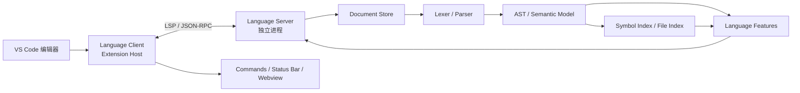
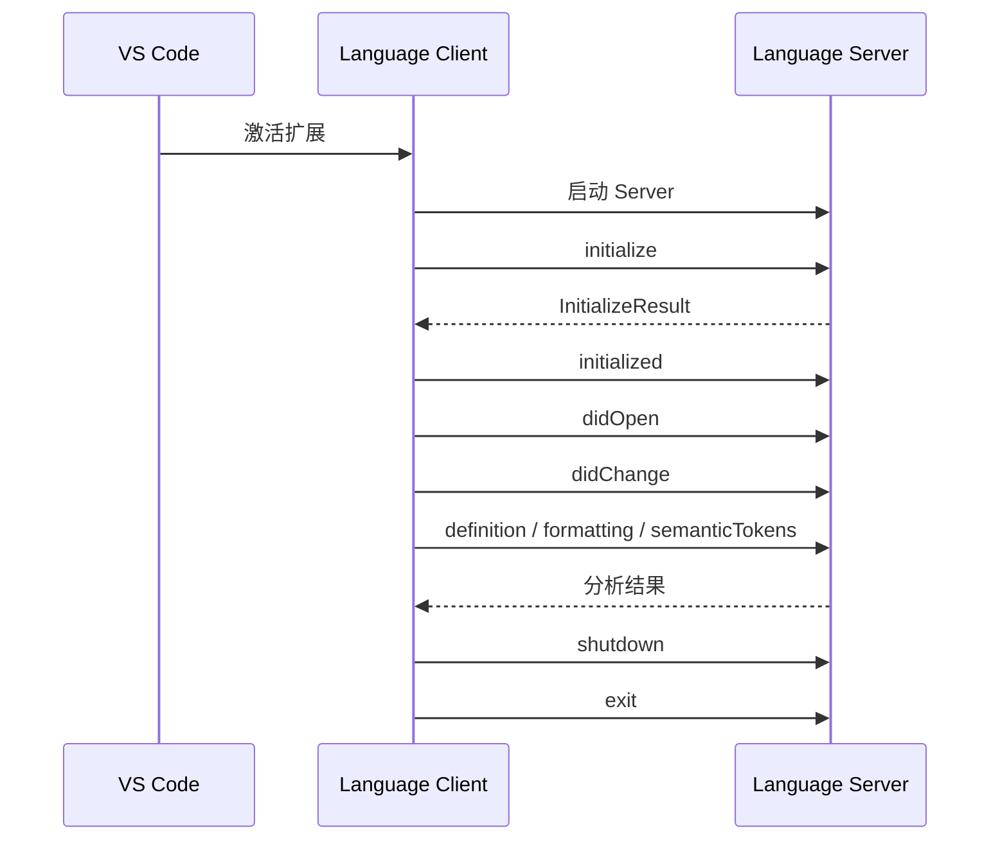
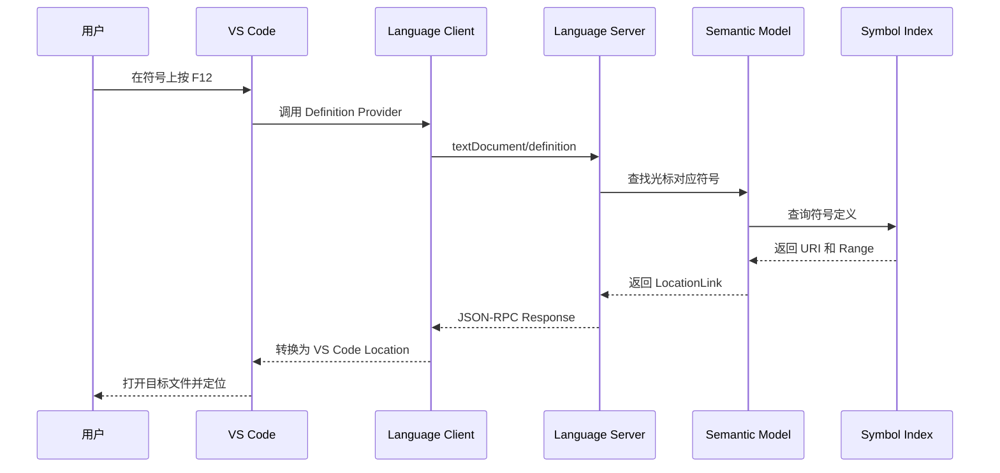
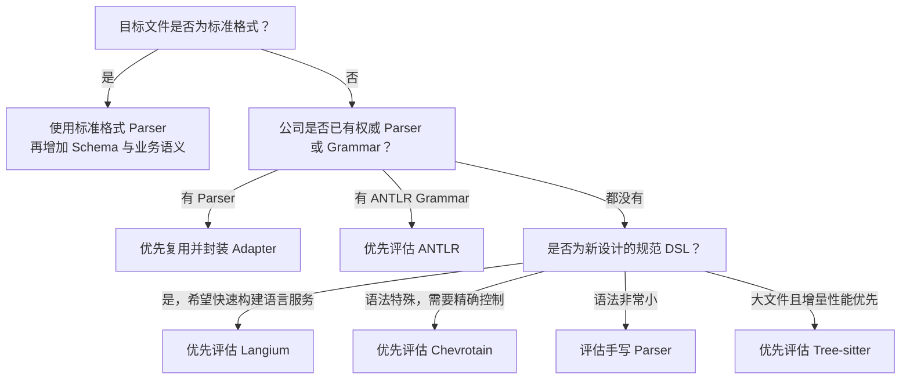
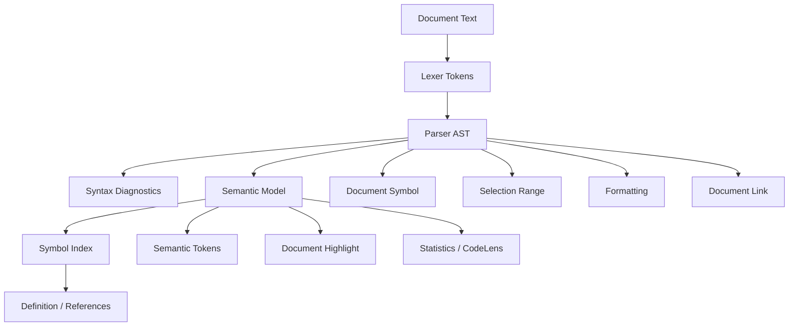
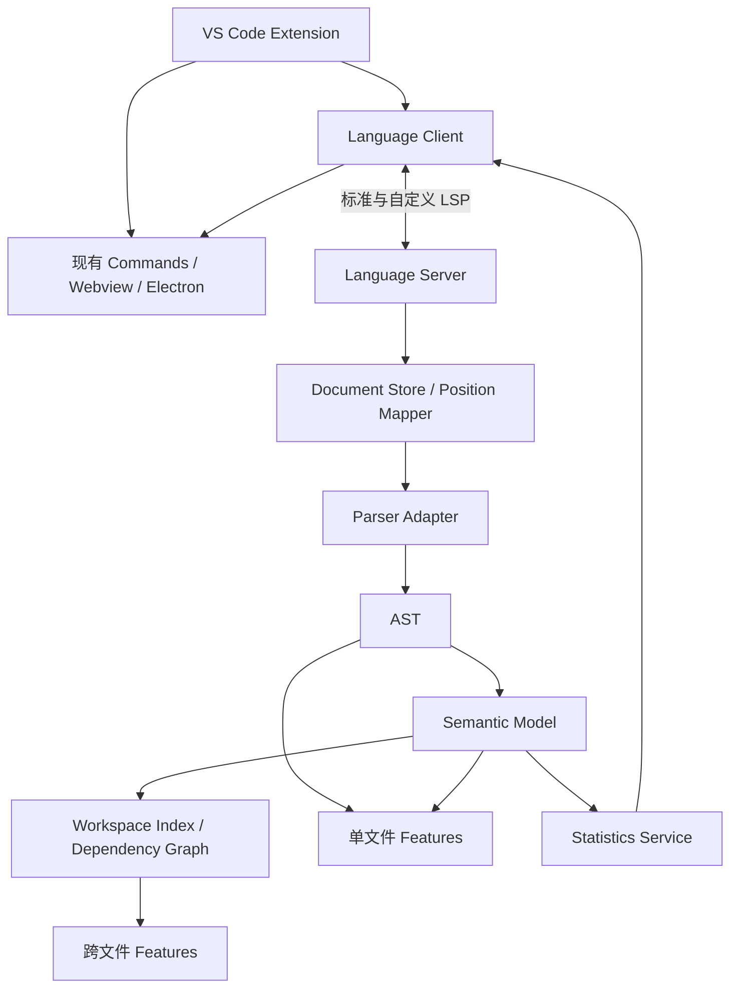

# VS Code LSP 学习与架构设计指南

> 面向第一次接触 VS Code 语言扩展和 Language Server Protocol 的开发者。
>
> 本文以 LSP 3.17 为主要参考版本，围绕文件高亮、智能选中、格式化、统计、链接跳转和打开文件等需求，解释原理、协议、架构与落地路线。

## 目录

- [1. 阅读目标](#1-阅读目标)
- [2. 先建立整体认识](#2-先建立整体认识)
- [3. VS Code 语言能力的三个层次](#3-vs-code-语言能力的三个层次)
- [4. LSP 的整体架构](#4-lsp-的整体架构)
- [5. LSP 通信原理](#5-lsp-通信原理)
- [6. 生命周期与能力协商](#6-生命周期与能力协商)
- [7. 文档同步机制](#7-文档同步机制)
- [8. LSP 的核心数据结构](#8-lsp-的核心数据结构)
- [9. 公司需求与协议能力映射](#9-公司需求与协议能力映射)
- [10. 高亮的两套机制](#10-高亮的两套机制)
- [11. 智能选中与符号高亮](#11-智能选中与符号高亮)
- [12. 格式化的实现原理](#12-格式化的实现原理)
- [13. 链接、定义跳转与打开文件](#13-链接定义跳转与打开文件)
- [14. 统计能力如何设计](#14-统计能力如何设计)
- [15. Lexer、Parser、AST 与语义模型](#15-lexerparserast-与语义模型)
- [16. Language Server 内部架构](#16-language-server-内部架构)
- [17. 结合当前项目的目录设计](#17-结合当前项目的目录设计)
- [18. 一次功能请求的完整流程](#18-一次功能请求的完整流程)
- [19. 性能与稳定性设计](#19-性能与稳定性设计)
- [20. 错误处理与安全边界](#20-错误处理与安全边界)
- [21. 测试策略](#21-测试策略)
- [22. 推荐实施路线](#22-推荐实施路线)
- [23. 推荐学习路线](#23-推荐学习路线)
- [24. 常见误区](#24-常见误区)
- [25. 术语表](#25-术语表)
- [26. UTF、Unicode 与位置转换专题](#26-utfunicode-与位置转换专题)
- [27. Language Client 深入实践](#27-language-client-深入实践)
- [28. Language Server 深入实践](#28-language-server-深入实践)
- [29. 文件解析技术与解析库选型](#29-文件解析技术与解析库选型)
- [30. Mini DSL 全链路案例](#30-mini-dsl-全链路案例)
- [31. 从 AST 到语义分析和工作区索引](#31-从-ast-到语义分析和工作区索引)
- [32. LSP 功能实现方法论](#32-lsp-功能实现方法论)
- [33. 调试与排障手册](#33-调试与排障手册)
- [34. 从入门到熟练的练习路线](#34-从入门到熟练的练习路线)
- [35. 技术选型结论与项目建议](#35-技术选型结论与项目建议)
- [36. 官方参考资料](#36-官方参考资料)

---

## 1. 阅读目标

阅读本文后，应当能够回答以下问题：

1. LSP 是什么，为什么需要 Language Client 和 Language Server？
2. 基础语法高亮和语义高亮有什么区别？
3. VS Code 如何把编辑中的文件同步给 Language Server？
4. 智能选中、格式化、统计、链接跳转分别对应哪些协议能力？
5. Lexer、Parser、AST、语义模型和符号索引分别负责什么？
6. 一个可维护的 Language Server 应该怎样分层？
7. 当前 VS Code 扩展项目应该如何逐步加入 LSP？

本文重点是建立完整的心智模型。协议接口名称需要记住，但更重要的是理解它们背后的数据流。

---

## 2. 先建立整体认识

### 2.1 什么是 LSP

LSP 全称是 Language Server Protocol，即语言服务器协议。

它定义了编辑器和语言分析工具之间如何通信。例如：

- 编辑器询问：“光标下这个符号的定义在哪里？”
- 服务器回答：“在 `file:///project/common.abc` 的第 20 行。”
- 编辑器询问：“这个文件应该怎样格式化？”
- 服务器回答：“请应用这些文本修改。”
- 服务器通知编辑器：“第 8 行存在语法错误。”

LSP 只规定消息格式和交互过程，并不负责真正解析文件。

### 2.2 LSP 不是什么

LSP 不是：

- 编译器；
- 解析器；
- 语法高亮主题；
- 文件格式化算法；
- VS Code 独有的 API；
- 用来显示 Webview 的 UI 框架。

可以把它理解成一套标准化“接口合同”：编辑器按照合同提出请求，服务器按照合同返回分析结果。

### 2.3 为什么需要 LSP

如果没有 LSP，一个语言工具需要分别适配不同编辑器：

```text
语言分析工具 × VS Code API
语言分析工具 × Vim API
语言分析工具 × Eclipse API
语言分析工具 × 其他 IDE API
```

使用 LSP 后，语言工具只需要实现一套协议，不同编辑器通过自己的 Language Client 接入它。

```text
VS Code ─┐
Vim ─────┼── LSP ── Language Server
其他 IDE ┘
```

LSP 带来两项直接收益：

1. Language Server 可以复用于多个编辑器。
2. 较重的解析和索引工作可以放在独立进程中，减少对 VS Code Extension Host 的影响。

---

## 3. VS Code 语言能力的三个层次

开发 VS Code 语言扩展时，不应把所有功能都归入 LSP。更准确的划分如下。

### 3.1 声明式语言能力

通过 `package.json`、TextMate Grammar 和 `language-configuration.json` 配置，不需要 Language Server。

典型功能：

- 文件扩展名与 language id；
- 基础语法高亮；
- 行注释和块注释；
- 括号匹配与自动闭合；
- 自动包围；
- 简单缩进规则；
- folding marker；
- snippets。

这些能力加载快，适合作为语言扩展的基础层。

### 3.2 程序化语言能力

通过 VS Code 的 `vscode.languages.*` API 直接注册 Provider。

例如：

```ts
vscode.languages.registerDefinitionProvider(...);
vscode.languages.registerDocumentFormattingEditProvider(...);
```

它适合功能简单、只针对 VS Code、无需跨编辑器复用的场景。

### 3.3 Language Server 能力

Language Client 将 VS Code 的语言请求转换为 LSP 消息，再转发给 Language Server。

适合：

- 需要解析 AST；
- 需要跨文件索引；
- 分析消耗较大；
- 希望支持多个编辑器；
- 语言分析逻辑与 VS Code UI 需要解耦。

实际项目通常混合使用三层能力：

```text
TextMate / language configuration
        +
Language Server 标准能力
        +
VS Code 专属 UI、命令、Webview
```

---

## 4. LSP 的整体架构

VS Code 中的 Language Server Extension 通常分为两部分。

### 4.1 Language Client

Language Client 是普通 VS Code 扩展代码，运行在 Extension Host 中。

主要职责：

- 根据文件类型激活扩展；
- 启动和停止 Language Server；
- 选择适用的文档；
- 转发标准 LSP 消息；
- 连接 VS Code 命令、状态栏、TreeView 和 Webview；
- 处理 VS Code 专属行为。

### 4.2 Language Server

Language Server 通常是独立进程。

主要职责：

- 管理正在编辑的文档快照；
- 词法分析和语法分析；
- 生成 AST；
- 建立符号表、引用关系和文件索引；
- 计算诊断、高亮、跳转、格式化和统计结果；
- 通过 LSP 返回标准数据。

### 4.3 架构图



### 4.4 为什么分析逻辑不应放进 Webview

Webview 更适合展示图表、表格和交互界面，不适合作为语言分析核心，因为：

- Webview 有单独的运行上下文；
- 生命周期与编辑器文档并不完全一致；
- 解析结果难以被跳转、诊断、高亮等多个功能共享；
- 跨文件索引和后台任务更难管理；
- 未来无法复用到其他编辑器。

正确分工是：Server 负责计算，Webview 负责展示。

---

## 5. LSP 通信原理

LSP 构建在 JSON-RPC 之上。消息主要分为 Request、Response 和 Notification。

### 5.1 Request：需要返回结果

客户端请求定义位置：

```json
{
  "jsonrpc": "2.0",
  "id": 12,
  "method": "textDocument/definition",
  "params": {
    "textDocument": {
      "uri": "file:///project/main.abc"
    },
    "position": {
      "line": 4,
      "character": 10
    }
  }
}
```

服务器响应：

```json
{
  "jsonrpc": "2.0",
  "id": 12,
  "result": {
    "uri": "file:///project/common.abc",
    "range": {
      "start": { "line": 19, "character": 0 },
      "end": { "line": 19, "character": 9 }
    }
  }
}
```

`id` 用于匹配请求和响应。请求可能乱序完成，因此不能依赖响应顺序。

### 5.2 Notification：不需要返回结果

文档变化通常使用 Notification：

```json
{
  "jsonrpc": "2.0",
  "method": "textDocument/didChange",
  "params": {}
}
```

常见 Notification：

- `initialized`
- `textDocument/didOpen`
- `textDocument/didChange`
- `textDocument/didSave`
- `textDocument/didClose`
- `workspace/didChangeConfiguration`
- `exit`

### 5.3 双向通信

LSP 不是单向的。服务器也可以向客户端发送请求或通知，例如：

- `textDocument/publishDiagnostics`
- `window/showMessage`
- `window/logMessage`
- `window/showDocument`
- `workspace/applyEdit`

### 5.4 传输方式

常见传输方式：

| 方式 | 特点 | 适用场景 |
|---|---|---|
| Node IPC | Node 进程间通信，集成方便 | TypeScript Client + TypeScript Server |
| stdio | 通用性最好 | 跨语言、跨编辑器 |
| socket | 可远程部署 | 独立服务或远程语言服务器 |

底层消息通常包含 `Content-Length` 头和 JSON Body：

```text
Content-Length: 123\r\n
\r\n
{...JSON body...}
```

使用官方 SDK 时，一般不需要自己解析这一层。

### 5.5 请求取消

某些分析可能耗时较长，例如：

- 全工作区引用搜索；
- 大文件语义高亮；
- 全工程符号搜索；
- 复杂格式化；
- 统计汇总。

客户端可以发送：

```text
$/cancelRequest
```

服务器应该周期性检查取消状态，尽快停止无意义的旧任务。

---

## 6. 生命周期与能力协商

### 6.1 生命周期顺序



正常结束时：

1. 客户端发送 `shutdown` 请求。
2. 服务器返回响应并停止接收正常业务请求。
3. 客户端发送 `exit` 通知。
4. 服务器进程退出。

### 6.2 为什么需要能力协商

不同编辑器和不同版本支持的 LSP 能力并不完全相同。

客户端在 `initialize` 中声明：

- 是否支持 Semantic Tokens Delta；
- 是否支持 `LocationLink`；
- 支持哪些 Position Encoding；
- 是否支持 Workspace Folders；
- 是否支持动态注册；
- 支持哪些 Markdown 内容格式。

服务器返回它提供的能力：

```ts
const result = {
    capabilities: {
        textDocumentSync: 2,
        definitionProvider: true,
        documentLinkProvider: {
            resolveProvider: true
        },
        documentFormattingProvider: true,
        documentRangeFormattingProvider: true,
        selectionRangeProvider: true,
        semanticTokensProvider: {
            legend: {
                tokenTypes: ['class', 'function', 'variable', 'property'],
                tokenModifiers: ['declaration', 'readonly']
            },
            full: { delta: true },
            range: true
        }
    }
};
```

不要直接假设客户端支持所有协议能力。先读取 Client Capabilities，再决定返回内容和注册方式。

---

## 7. 文档同步机制

### 7.1 为什么不能只读取硬盘文件

用户输入后可能尚未保存。此时：

```text
编辑器中的内容 ≠ 硬盘中的内容
```

如果 Server 每次都从磁盘读取，就会分析旧版本文件，导致：

- 高亮位置错误；
- 诊断滞后；
- 跳转结果失效；
- 格式化覆盖用户未保存的修改。

因此 Language Server 必须维护内存中的文档快照。

### 7.2 文档同步事件

```text
didOpen   → 发送初始文档内容
didChange → 发送修改内容
didSave   → 通知文件已保存
didClose  → 文档关闭，可清理内存
```

### 7.3 Full 全量同步

每次修改发送整份文件内容。

优点：

- 容易实现；
- 不容易出现增量应用错误；
- 适合原型和小文件。

缺点：

- 大文件传输成本高；
- 每次输入都复制全文；
- 不利于高频编辑。

### 7.4 Incremental 增量同步

只发送变化范围和新文本：

```ts
{
    range: {
        start: { line: 8, character: 2 },
        end: { line: 8, character: 5 }
    },
    text: 'newValue'
}
```

正式产品通常采用 Incremental。

需要区分两个概念：

- 增量同步：只传输变化文本；
- 增量解析：只重新解析受影响的语法树部分。

第一版可以使用“增量同步 + 全文重新解析”，待性能成为问题后再实现增量解析。

### 7.5 文档版本

每次文档修改都有递增的 `version`。异步任务完成时，必须确认结果对应的版本仍然有效。

例如：

```text
版本 10 开始语义分析
版本 11 用户继续输入
版本 11 的分析先完成
版本 10 的分析后完成
```

如果不检查版本，版本 10 的旧结果可能覆盖版本 11 的新结果。

---

## 8. LSP 的核心数据结构

### 8.1 URI

LSP 用 URI 标识文档：

```text
file:///Users/example/project/main.abc
```

不能把本地路径当普通字符串随意处理，因为还需要支持：

- Windows 盘符；
- 中文和空格编码；
- Remote SSH；
- 容器工作区；
- 虚拟文件系统；
- `untitled:` 未保存文档。

### 8.2 Position

```ts
interface Position {
    line: number;
    character: number;
}
```

注意：

- `line` 从 0 开始；
- `character` 从 0 开始；
- LSP 3.17 支持协商 Position Encoding；
- 未协商时通常以 UTF-16 为基础；
- JavaScript 字符串索引同样使用 UTF-16 code unit。

### 8.3 Range

```ts
interface Range {
    start: Position;
    end: Position;
}
```

Range 通常采用左闭右开：包含 `start`，不包含 `end`。

### 8.4 UTF-8 字节偏移与 UTF-16 位置

某些解析器返回 UTF-8 byte offset，而 LSP Position 可能使用 UTF-16 单元。二者不能直接混用。

```text
Parser byteOffset
       ↕
PositionMapper
       ↕
LSP line / character
```

中文 BMP 字符一般占一个 UTF-16 code unit；部分 emoji 会占两个。如果转换不正确，emoji 后面的诊断和跳转位置会整体偏移。

### 8.5 Location 与 LocationLink

`Location` 描述目标 URI 和目标范围：

```ts
interface Location {
    uri: string;
    range: Range;
}
```

`LocationLink` 还可以描述：

- 发起跳转的源范围；
- 目标完整定义范围；
- 目标名称选择范围。

跨文件跳转优先考虑 `LocationLink`，用户体验通常更好。

### 8.6 TextEdit

```ts
interface TextEdit {
    range: Range;
    newText: string;
}
```

格式化、重命名和部分 Code Action 都通过 TextEdit 或 WorkspaceEdit 修改文本。

---

## 9. 公司需求与协议能力映射

| 业务需求 | 推荐机制 | LSP 方法或 VS Code 能力 |
|---|---|---|
| 文件类型识别 | Language Contribution | `contributes.languages` |
| 基础语法高亮 | TextMate Grammar | 非 LSP |
| 语义高亮 | Semantic Tokens | `textDocument/semanticTokens/full` |
| 可见范围语义高亮 | Semantic Tokens Range | `textDocument/semanticTokens/range` |
| 增量语义高亮 | Semantic Tokens Delta | `textDocument/semanticTokens/full/delta` |
| 同符号高亮 | Document Highlight | `textDocument/documentHighlight` |
| 智能扩大选区 | Selection Range | `textDocument/selectionRange` |
| 全文格式化 | Formatting | `textDocument/formatting` |
| 选区格式化 | Range Formatting | `textDocument/rangeFormatting` |
| 输入时格式化 | On Type Formatting | `textDocument/onTypeFormatting` |
| 文本可点击链接 | Document Link | `textDocument/documentLink` |
| 延迟解析链接 | Document Link Resolve | `documentLink/resolve` |
| 跳到定义 | Definition | `textDocument/definition` |
| 查找引用 | References | `textDocument/references` |
| 请求客户端打开文档 | Show Document | `window/showDocument` |
| 声明上方统计 | CodeLens | `textDocument/codeLens` |
| 行尾统计 | Inlay Hint | `textDocument/inlayHint` |
| 文件/工程统计 | 自定义协议 | 如 `company/getStatistics` |
| 错误与警告 | Diagnostics | `textDocument/publishDiagnostics` 等 |
| 文件大纲 | Document Symbol | `textDocument/documentSymbol` |
| 工程符号搜索 | Workspace Symbol | `workspace/symbol` |

---

## 10. 高亮的两套机制

### 10.1 TextMate 基础语法高亮

TextMate Grammar 主要通过正则表达式把文本分成 token，并为 token 分配 scope。

```text
关键字 abc      → keyword.control.abc
字符串 "hello"  → string.quoted.double.abc
注释 // text    → comment.line.abc
数字 123        → constant.numeric.abc
```

主题再根据 scope 决定颜色和字体样式。

特点：

- 启动快；
- 用户输入时立即生效；
- 不需要 Language Server；
- 不理解跨文件语义；
- 很难区分同名变量的真实类别。

### 10.2 Semantic Tokens 语义高亮

Semantic Tokens 由 Language Server 根据 AST 和语义模型计算。

例如相同文本 `count` 可以被区分成：

```text
局部变量 count
只读属性 count
函数参数 count
字段声明 count
```

服务器先声明 Legend：

```ts
const legend = {
    tokenTypes: [
        'namespace',
        'type',
        'class',
        'function',
        'variable',
        'property'
    ],
    tokenModifiers: [
        'declaration',
        'readonly',
        'static',
        'deprecated'
    ]
};
```

返回 token 时使用 Legend 中的整数索引。协议还使用相对行列编码，以减少消息大小。

### 10.3 推荐组合

```text
TextMate：快速、稳定的基础高亮
                 +
Semantic Tokens：解析完成后的精确语义覆盖
```

不要只做 Semantic Tokens。服务器启动、索引或解析失败时，TextMate 仍能提供基本可读性。

---

## 11. 智能选中与符号高亮

“选中”可能指三种不同需求，需要先区分。

### 11.1 智能扩大选区

示例：

```text
变量名
→ 函数调用
→ 完整表达式
→ 当前语句
→ 当前代码块
```

对应：

```text
textDocument/selectionRange
```

服务器返回嵌套的 `SelectionRange`，每个节点通过 `parent` 指向更大的范围。

最自然的实现方式是：

1. 找到光标位置最深层的 AST 节点。
2. 返回该节点 Range。
3. 沿 AST parent 向上遍历。
4. 过滤相同 Range 和无意义节点。
5. 构造 SelectionRange parent 链。

### 11.2 高亮同一符号

用户把光标放在变量上时，高亮当前文档中的所有同一符号。

对应：

```text
textDocument/documentHighlight
```

高亮类型：

- `Text`：普通出现；
- `Read`：读取；
- `Write`：写入。

应该基于符号绑定结果，不能简单执行字符串搜索。不同作用域可能存在同名变量，但它们不是同一个符号。

### 11.3 用户鼠标选择内容

鼠标选区变化是 VS Code UI 事件，不是标准 LSP 请求。

Language Client 可以监听：

```ts
vscode.window.onDidChangeTextEditorSelection(...);
```

如果需要分析选中内容，再向 Server 发送自定义请求。

---

## 12. 格式化的实现原理

### 12.1 格式化不是直接覆盖文件

Language Server 返回一组 TextEdit，VS Code 负责应用修改。

例如把：

```text
key:value
```

改成：

```text
key: value
```

服务器可以返回：

```json
{
  "range": {
    "start": { "line": 0, "character": 4 },
    "end": { "line": 0, "character": 4 }
  },
  "newText": " "
}
```

### 12.2 三种常见实现方式

#### 方式一：基于 Token 调整

扫描 token，根据相邻 token 类型调整空格、换行和缩进。

优点是实现快；缺点是复杂嵌套结构容易失控。

#### 方式二：基于 AST Pretty Printer

先解析 AST，再按照统一规则重新输出文本。

优点：

- 规则集中；
- 结构清晰；
- 容易保证格式一致；
- 易于单元测试。

缺点是需要处理注释、空白保留和错误语法。

#### 方式三：复用已有 Formatter

调用已有工具生成格式化全文，再计算原文和新文本之间的 diff。

### 12.3 为什么要返回最小编辑

整篇替换虽然简单，但可能影响：

- 光标和选区；
- 断点；
- 诊断范围；
- 撤销体验；
- Git diff；
- 其他扩展维护的装饰信息。

因此应尽量返回小范围、互不重叠的 TextEdit。

### 12.4 格式化必须满足的性质

#### 幂等性

```text
format(format(text)) === format(text)
```

连续格式化两次，第二次不应继续改变文件。

#### 错误容忍

用户输入时文件经常处于不完整状态。格式化器不应因缺少一个括号就崩溃或删除大量内容。

#### 配置稳定

缩进宽度、Tab/Space、换行符等应读取 FormattingOptions 或工作区配置。

### 12.5 推荐实现顺序

1. 全文格式化；
2. 选区格式化；
3. 粘贴格式化；
4. 输入时格式化。

输入时格式化对性能和错误恢复要求最高，应最后实现。

---

## 13. 链接、定义跳转与打开文件

这三项看起来相似，但语义不同。

### 13.1 Document Link：文本本身是链接

示例：

```text
include "./common/config.abc"
https://example.com
```

对应：

```text
textDocument/documentLink
```

返回示例：

```json
{
  "range": {
    "start": { "line": 4, "character": 9 },
    "end": { "line": 4, "character": 28 }
  },
  "target": "file:///project/common/config.abc",
  "tooltip": "打开引用文件"
}
```

如果解析目标成本较高，可以先返回 `range` 和 `data`，点击时再用 `documentLink/resolve` 补全 `target`。

### 13.2 Definition：符号定义在哪里

示例：

```text
use DataBlock
```

用户按 F12，希望找到 `DataBlock` 的声明位置。

对应：

```text
textDocument/definition
```

服务器应：

1. 找到光标下的 AST 节点。
2. 从语义模型中找到绑定的 Symbol。
3. 从 Symbol Index 中查找定义。
4. 返回 Location 或 LocationLink。

### 13.3 Show Document：服务器主动要求打开文件

对应：

```text
window/showDocument
```

这不是普通跳转的首选。标准导航应优先返回 Location 或 DocumentLink，让客户端决定如何展示。

适合主动打开的场景：

- 用户执行了一个明确的业务命令；
- 服务器生成了一个报告文件；
- 操作完成后需要展示结果文档。

### 13.4 路径解析规则

链接解析需要明确：

- 相对路径相对于当前文件还是工作区根目录；
- 是否允许跨工作区；
- 是否允许访问工作区外文件；
- 大小写是否敏感；
- 扩展名是否允许省略；
- 目标不存在时返回空结果还是诊断；
- 如何处理软链接；
- 如何处理 URI 编码；
- Remote/Container 环境中由谁访问文件。

建议将路径规则集中在 `LinkResolver` 或 `FileResolver` 中，不要散落在不同 Handler 中。

---

## 14. 统计能力如何设计

LSP 没有一个通用的 `statistics` 标准方法。应先确定统计结果展示在哪里。

### 14.1 CodeLens：显示在声明上方

例如：

```text
3 references | 128 bytes | 5 warnings
DataBlock main
```

对应：

```text
textDocument/codeLens
codeLens/resolve
```

CodeLens 可以绑定 VS Code Command，点击后打开明细面板或跳转到相关位置。

### 14.2 Inlay Hint：显示在代码行内

例如：

```text
DataBlock main    128 bytes, 32 entries
```

对应：

```text
textDocument/inlayHint
```

适合轻量、局部、与代码位置直接相关的统计。

### 14.3 Webview：显示复杂统计

适合：

- 图表；
- 数据表格；
- 多文件对比；
- 趋势分析；
- 筛选和排序；
- 可视化报告。

推荐数据流：

```text
Webview
  ↓ 消息
Language Client
  ↓ 自定义 LSP Request
Language Server
  ↓ 使用 AST / Index 计算
Language Client
  ↓ 返回数据
Webview 展示
```

### 14.4 自定义 LSP 请求

可以定义公司内部协议：

```text
company/getDocumentStatistics
company/getWorkspaceStatistics
```

参数示例：

```ts
interface StatisticsParams {
    textDocument: {
        uri: string;
    };
    range?: Range;
}
```

返回值示例：

```ts
interface DocumentStatistics {
    itemCount: number;
    errorCount: number;
    referencedFiles: number;
    memorySize: number;
}
```

自定义协议需要注意：

- 方法名增加公司或产品前缀；
- 请求和返回类型放在 Client/Server 共享模块；
- 明确协议版本；
- 保持向后兼容；
- 不要把 VS Code UI 类型直接暴露给 Server。

---

## 15. Lexer、Parser、AST 与语义模型

Language Server 的核心不是协议 Handler，而是文件分析模型。

### 15.1 Lexer：词法分析器

Lexer 把字符流转换成 Token 流。

输入：

```text
include "common.abc"
```

输出概念示例：

```text
Keyword(include)
String("common.abc")
NewLine
EOF
```

每个 Token 应保存：

- 类型；
- 原始文本或值；
- 起始和结束位置；
- 必要时保存 trivia，例如空白和注释。

### 15.2 Parser：语法分析器

Parser 根据语法规则把 Token 组织成 AST。

```text
IncludeStatement
├── keyword: include
└── path: "common.abc"
```

Parser 应尽量具备错误恢复能力。用户输入期间，文件经常临时缺少括号、引号或结尾符号。

### 15.3 AST：抽象语法树

AST 表示文件的结构和含义，不只是字符排列。

每个 AST 节点建议保存：

- 节点类型；
- Range 或 offset；
- 子节点；
- parent 或可反向查找的索引；
- 需要保留的 token 信息。

AST 可直接服务：

- Selection Range；
- Document Symbol；
- Folding Range；
- 格式化；
- 部分 Semantic Tokens；
- 基础统计。

### 15.4 Semantic Model：语义模型

AST 只知道“这是一个名称”，语义模型还要知道：

- 它是变量、类型、字段还是函数；
- 声明在哪里；
- 属于哪个作用域；
- 引用了哪个符号；
- 是否只读；
- 是否存在重复定义；
- 是否满足业务约束。

语义模型服务：

- Definition；
- References；
- Document Highlight；
- Rename；
- 精确 Semantic Tokens；
- 语义 Diagnostics；
- 跨文件统计。

### 15.5 Symbol Index：符号索引

单文件语义模型只能回答当前文件问题。跨文件跳转需要工作区级索引。

索引可以包含：

```ts
interface SymbolRecord {
    id: string;
    name: string;
    kind: string;
    definitionUri: string;
    definitionRange: Range;
    references: Array<{
        uri: string;
        range: Range;
    }>;
}
```

第一版可以使用内存 Map。工程较大后再考虑持久化索引、分片缓存和增量更新。

---

## 16. Language Server 内部架构

推荐将协议接入、文档管理、分析引擎和语言功能分离。

```text
server/
├── main.ts
├── protocol/
│   └── customRequests.ts
├── documents/
│   ├── documentStore.ts
│   └── positionMapper.ts
├── parser/
│   ├── token.ts
│   ├── lexer.ts
│   ├── ast.ts
│   └── parser.ts
├── analysis/
│   ├── semanticModel.ts
│   ├── diagnostics.ts
│   ├── statistics.ts
│   └── linkResolver.ts
├── index/
│   ├── symbolIndex.ts
│   ├── fileIndex.ts
│   └── dependencyGraph.ts
├── features/
│   ├── semanticTokens.ts
│   ├── documentHighlight.ts
│   ├── selectionRange.ts
│   ├── formatting.ts
│   ├── definition.ts
│   ├── references.ts
│   ├── documentLink.ts
│   └── codeLens.ts
└── tests/
```

### 16.1 各层职责

#### `main.ts`

- 创建 LSP connection；
- 声明能力；
- 注册 Handler；
- 管理生命周期；
- 不包含复杂业务逻辑。

#### `documents/`

- 保存当前文本和版本；
- 应用增量修改；
- Position 与 offset 转换；
- 管理打开和关闭状态。

#### `parser/`

- 字符到 Token；
- Token 到 AST；
- 语法错误恢复；
- 不负责 VS Code UI。

#### `analysis/`

- 名称绑定；
- 业务规则校验；
- 路径解析；
- 统计计算；
- 生成中立的分析结果。

#### `index/`

- 跨文件定义；
- 引用关系；
- 文件依赖关系；
- 文件变化后的失效和重建。

#### `features/`

- 把分析模型转换成 LSP 数据结构；
- 不重复解析文本；
- 不自己维护另一套符号含义。

### 16.2 最重要的架构原则

```text
所有功能共享同一套 Token、AST、语义模型和索引。
```

不要让每个 Handler 单独用正则重新扫描文件。否则不同功能会产生互相矛盾的结果。

---

## 17. 结合当前项目的目录设计

当前项目已经包含：

```text
src/extension.ts
src/ext/
src/shared/
src/webview/
src/electron/
```

现有代码以命令、Webview、数据展示和 Electron 工作台为主。建议在旁边独立增加语言客户端和服务器模块。

推荐目录：

```text
src/
├── extension.ts
├── ext/
│   ├── lsp/
│   │   ├── startLanguageClient.ts
│   │   └── clientCommands.ts
│   ├── register/
│   ├── providers/
│   ├── webviews/
│   └── electron/
├── server/
│   ├── server.ts
│   ├── documents/
│   ├── parser/
│   ├── analysis/
│   ├── index/
│   └── features/
├── shared/
│   ├── messages.ts
│   ├── languageTypes.ts
│   └── statisticsProtocol.ts
├── webview/
└── test/
```

### 17.1 入口职责

`src/extension.ts` 应保持轻量：

```text
activate
├── 注册已有命令和 Webview
├── 注册 Electron 命令
└── 启动 Language Client

deactivate
├── 停止 Language Client
└── 清理其他资源
```

### 17.2 Client 与现有 Webview 的关系

Language Client 可以作为桥梁：

```text
Webview 消息
    ↓
Extension / Language Client
    ↓
自定义 LSP 请求
    ↓
Language Server 统计
```

这样现有数据面板仍然可以复用，但统计数据来自统一分析引擎。

### 17.3 常用 SDK

TypeScript 方案通常会使用：

```text
vscode-languageclient
vscode-languageserver
vscode-languageserver-textdocument
```

它们分别帮助实现 VS Code Client、Server 连接和文本同步。具体版本应根据项目的 VS Code Engine、Node 版本及 SDK 发布说明确定。

---

## 18. 一次功能请求的完整流程

以“跳到定义”为例：



以“用户输入后刷新语义高亮”为例：

```text
用户输入
→ VS Code 更新 TextDocument
→ Client 发送 didChange
→ Server 更新 Document Store
→ 防抖后重新解析
→ 更新 AST 和语义模型
→ VS Code 请求 Semantic Tokens
→ Server 从模型生成 Tokens
→ VS Code 应用主题颜色
```

---

## 19. 性能与稳定性设计

### 19.1 防抖

用户输入频率可能很高。不应每个字符都立即执行全工程分析。

可以区分：

- 语法分析：较短防抖或立即执行；
- 跨文件索引：较长防抖；
- 全工程统计：后台执行；
- UI 展示：只展示最新版本结果。

### 19.2 任务取消

旧版本任务应尽快取消。例如用户连续输入时，前一个 Semantic Tokens 请求可能已经没有价值。

### 19.3 缓存层次

可以缓存：

- 文档文本；
- Token；
- AST；
- Semantic Model；
- 文件统计；
- 符号索引；
- Semantic Tokens resultId。

缓存必须明确失效条件。文件变化后，至少要使其 AST、语义模型、统计和相关依赖缓存失效。

### 19.4 文件依赖图

如果 A 引用 B，B 发生变化时，A 可能需要重新分析。

```text
A → B → C
```

修改 C 后，不一定需要重新解析整个工作区，但至少需要重新检查受影响的依赖链。

### 19.5 大文件降级

建议设定可配置阈值：

- 超大文件只提供 TextMate 高亮；
- 限制诊断数量；
- Semantic Tokens 仅处理可见范围；
- 暂停昂贵的全量统计；
- 给出明确状态提示。

### 19.6 多根工作区

VS Code 可以同时打开多个 Workspace Folder。需要明确：

- 每个工作区一个 Server；
- 或一个 Server 管理多个根目录；
- 配置按哪个根目录读取；
- 同名符号如何隔离；
- 相对路径以哪个根目录解析。

第一版可以限制为单根工作区，但应在架构上保留 Workspace Context。

### 19.7 Server 崩溃恢复

Client 应处理：

- Server 无法启动；
- Server 非正常退出；
- 自动重启次数限制；
- 日志输出；
- 向用户显示可理解的错误；
- 重启后重新同步已打开文档。

---

## 20. 错误处理与安全边界

### 20.1 错误分类

建议区分：

| 类别 | 示例 | 处理方式 |
|---|---|---|
| 用户文件错误 | 语法错误、引用不存在 | Diagnostics |
| 配置错误 | 路径配置无效 | Diagnostic 或 Warning |
| 可恢复内部错误 | 某文件解析失败 | 记录日志，隔离文件 |
| 不可恢复错误 | 初始化资源失败 | 启动失败并提示用户 |
| 取消 | 请求已过期 | 正常结束，不报内部错误 |

不要把普通语法错误作为异常抛出。语法错误是 Language Server 的正常输入状态。

### 20.2 文件访问边界

如果 Server 能根据文档内容打开文件，应考虑：

- 是否允许访问工作区外路径；
- 是否遵守 VS Code Workspace Trust；
- 是否防止 `../../` 路径穿越；
- 是否允许网络 URL；
- 是否执行文件内容；
- 是否跟随软链接；
- 日志是否包含敏感路径或源代码。

### 20.3 日志与隐私

建议日志默认只记录：

- 方法名；
- 请求耗时；
- 文档 URI 的必要部分；
- 错误类型和堆栈；
- 缓存命中和索引状态。

不要默认上传：

- 完整源文件；
- 公司内部路径；
- 用户输入内容；
- 业务数据；
- 未脱敏的统计结果。

---

## 21. 测试策略

### 21.1 Lexer 测试

- 每一种 Token；
- 中文字符串；
- emoji；
- 转义字符；
- 注释；
- 非法字符；
- 文件末尾；
- 超长行。

### 21.2 Parser 测试

- 正常语法；
- 嵌套结构；
- 缺少结束符；
- 缺少引号；
- 输入一半的语句；
- 错误恢复后能否继续解析后续节点。

### 21.3 PositionMapper 测试

- offset 与 Position 双向转换；
- Windows 换行 `\r\n`；
- Unix 换行 `\n`；
- 中文；
- emoji 后的位置；
- 空文件；
- 文件最后一个字符。

### 21.4 格式化测试

- 预期文本快照；
- 幂等性；
- TextEdit 不重叠；
- 空文件；
- 错误语法；
- 注释不丢失；
- CRLF/LF 策略；
- 选区外内容不变化。

### 21.5 跳转与链接测试

- 当前文件定义；
- 跨文件定义；
- 相对路径；
- 中文路径；
- 包含空格的路径；
- 不存在的文件；
- 同名符号不同作用域；
- 多工作区同名文件；
- 未保存文件。

### 21.6 文档同步测试

- didOpen 后内容一致；
- 多次增量修改；
- 旧 version 结果不覆盖新结果；
- didClose 后释放资源；
- Server 重启后恢复打开文档。

### 21.7 集成测试

启动 VS Code Extension Development Host，验证：

- 扩展按目标文件激活；
- Server 成功启动；
- LSP trace 中消息正确；
- 高亮、跳转、格式化和统计符合预期；
- 关闭扩展时 Server 正常退出。

---

## 22. 推荐实施路线

### 阶段一：最小语言扩展

目标：让 VS Code 识别公司文件并提供基础编辑体验。

- 确定 language id；
- 确定文件扩展名；
- 注册 `contributes.languages`；
- 编写 `language-configuration.json`；
- 编写最小 TextMate Grammar；
- 支持关键字、字符串、数字、注释和括号。

这一阶段不需要 LSP。

### 阶段二：建立最小 LSP 链路

目标：Client 和 Server 能稳定通信。

- 创建 Language Client；
- 创建独立 Language Server；
- 完成 initialize/initialized；
- 实现 didOpen/didChange/didClose；
- 实现一个固定 Hover 或 Diagnostic；
- 打开 LSP trace；
- 增加 Server 启停日志。

### 阶段三：实现 Lexer、Parser 和 AST

目标：Server 能理解单文件结构。

- 定义 Token；
- 定义 AST；
- 每个节点保存准确 Range；
- 实现错误恢复；
- 输出语法 Diagnostics；
- 建立 PositionMapper 测试。

### 阶段四：实现单文件能力

推荐顺序：

1. Document Symbol；
2. Document Link；
3. Selection Range；
4. Document Highlight；
5. Semantic Tokens；
6. 全文 Formatting；
7. CodeLens 或单文件统计。

### 阶段五：实现跨文件能力

- include/import/reference 解析；
- File Index；
- Symbol Index；
- Definition；
- References；
- Workspace Symbol；
- 文件创建、删除、重命名监听；
- 依赖图增量更新。

### 阶段六：统计与现有 UI 集成

- 定义统计数据模型；
- 定义自定义 LSP 请求；
- Server 复用 AST 和索引计算统计；
- Client 将数据交给现有 Webview；
- Webview 负责表格、图表和交互。

### 阶段七：性能与产品化

- 增量同步；
- 请求取消；
- 防抖；
- 缓存；
- Semantic Tokens Delta；
- 大文件降级；
- 多根工作区；
- Server 崩溃重启；
- 性能指标与隐私审查。

### 推荐的第一版产品范围

```text
文件识别
+ TextMate 基础高亮
+ 最小 Parser / AST
+ Diagnostics
+ Document Link
+ Definition
+ 全文 Formatting
+ CodeLens 统计
```

先完成闭环，再增加语义高亮、引用搜索、智能选区和大工程优化。

---

## 23. 推荐学习路线

### 第一层：VS Code 扩展基础

掌握：

- `activate` / `deactivate`；
- `ExtensionContext`；
- Command 注册；
- `context.subscriptions`；
- `package.json` contribution points；
- Extension Development Host 调试。

### 第二层：协议基础

掌握：

- JSON-RPC Request/Response/Notification；
- initialize 和 capabilities；
- URI、Position、Range、Location、TextEdit；
- didOpen/didChange/didClose；
- shutdown/exit；
- 取消和错误响应。

### 第三层：编译原理基础

掌握：

- Token；
- Lexer；
- Parser；
- AST；
- 作用域；
- Symbol；
- Definition 与 Reference；
- 错误恢复。

不需要先完整学习编译器后端、机器码和优化器。Language Server 最相关的是前端分析部分。

### 第四层：实现单文件功能

顺序建议：

```text
Diagnostics
→ Document Symbol
→ Document Link
→ Selection Range
→ Semantic Tokens
→ Formatting
```

### 第五层：实现工作区功能

掌握：

- Workspace Folder；
- 文件监听；
- 符号索引；
- 依赖图；
- 缓存失效；
- 异步并发和取消。

---

## 24. 常见误区

### 误区一：所有高亮都用 LSP

基础高亮优先使用 TextMate，语义高亮再用 Semantic Tokens。

### 误区二：每个 LSP Handler 都自己解析文本

应该共享 Document Model、AST、Semantic Model 和 Index。

### 误区三：只读取磁盘文件

未保存内容必须来自文档同步。

### 误区四：跳转就是打开文件

DocumentLink、Definition 和 ShowDocument 的语义不同，应根据用户操作选择。

### 误区五：用字符串搜索实现符号引用

字符串相同不代表语义上是同一个符号，必须考虑作用域和绑定关系。

### 误区六：格式化直接整篇替换

能工作，但用户体验和兼容性较差。应尽量产生最小 TextEdit。

### 误区七：把语法错误当异常

用户输入时出现不完整语法是正常情况，应生成 Diagnostic 并继续分析。

### 误区八：第一版就做增量 AST

先实现正确的全文解析，再用性能数据决定是否引入增量解析。

### 误区九：把统计逻辑放在 Webview

统计应复用 Language Server 的 AST 和索引；Webview 只负责展示。

### 误区十：忽略 UTF-16 和 emoji

这是诊断范围和跳转错位的常见原因，必须有专门测试。

---

## 25. 术语表

| 术语 | 含义 |
|---|---|
| LSP | Language Server Protocol，语言服务器协议 |
| Language Client | 编辑器侧协议适配器，负责连接 VS Code 与 Server |
| Language Server | 负责解析、语义分析和语言功能的独立程序 |
| JSON-RPC | LSP 使用的消息调用协议 |
| Capability | 客户端或服务器声明的功能支持情况 |
| TextDocument | 编辑器中的文本文件抽象，可能尚未保存 |
| URI | LSP 中用于标识文档的统一资源标识符 |
| Position | 零基的行、字符位置 |
| Range | 由起点和终点组成的文本范围 |
| Location | 文档 URI 与 Range 的组合 |
| TextEdit | 对某个 Range 进行文本替换的编辑描述 |
| Token | 词法分析得到的最小有意义单元 |
| Lexer | 把字符流转换为 Token 流的词法分析器 |
| Parser | 把 Token 流转换为 AST 的语法分析器 |
| AST | Abstract Syntax Tree，抽象语法树 |
| Semantic Model | 描述定义、引用、作用域和符号含义的语义模型 |
| Symbol | 变量、类型、函数、字段等具有语义身份的实体 |
| Symbol Index | 保存工作区符号定义与引用位置的索引 |
| Diagnostic | 错误、警告、提示等诊断信息 |
| TextMate Grammar | VS Code 基础语法高亮使用的正则语法规则 |
| Semantic Tokens | Language Server 提供的语义级高亮信息 |
| CodeLens | 显示在代码声明上方的可点击信息 |
| Inlay Hint | 显示在代码行内的补充信息 |
| Full Sync | 每次变化发送完整文档 |
| Incremental Sync | 每次只发送变化范围和新文本 |
| Incremental Parsing | 只重新解析受修改影响的语法树区域 |
| Debounce | 高频事件发生时延迟并合并执行 |

---

## 26. UTF、Unicode 与位置转换专题

> 如果前文所说的 “utd” 实际指 UTF，那么本章就是对应的完整知识。如果 “UTD” 是公司内部格式或工具名称，应再为它补充专门章节。

位置转换是 LSP 开发中最容易被低估的基础设施。高亮、诊断、跳转、格式化、选区和链接最终都依赖准确的 Range；只要位置模型出错，几乎所有功能都会一起出错。

### 26.1 字节、字符、Code Point 与 Code Unit

日常说的“字符”在程序中可能指不同概念。

| 概念 | 含义 |
|---|---|
| Byte | 存储单位，一个字节是 8 bit |
| Unicode Code Point | Unicode 为抽象字符分配的编号，例如 `U+4E2D` |
| Code Unit | 某种编码用于表示 Code Point 的基本单元 |
| Grapheme Cluster | 用户视觉上认为的一个字符，可能由多个 Code Point 组合 |

UTF-8、UTF-16 和 UTF-32 都是在编码 Unicode，但使用的 Code Unit 和长度规则不同。

```text
文本：A😀中

Code Point 数量：3
UTF-8 字节数：1 + 4 + 3 = 8
UTF-16 Code Unit 数量：1 + 2 + 1 = 4
```

JavaScript 示例：

```ts
const text = 'A😀中';

console.log(text.length);          // 4，UTF-16 Code Unit 数量
console.log([...text].length);     // 3，按 Code Point 迭代
console.log(new TextEncoder().encode(text).length); // 8，UTF-8 字节数
```

视觉上的字符数还可能不同。例如某些重音符号由基础字母和组合符号构成，多个 Code Point 仍可能显示为一个字形。

### 26.2 为什么 JavaScript 与 LSP 常常比较容易配合

JavaScript 字符串索引使用 UTF-16 Code Unit：

```ts
const value = '😀';
console.log(value.length); // 2
```

LSP 历史上默认使用 UTF-16 位置，因此 TypeScript Language Server 使用字符串索引时通常比较自然。不过仍然不能忽略：

- Parser 是否返回 UTF-8 byte offset；
- Client 和 Server 是否协商了其他 Position Encoding；
- 换行符是 `\n` 还是 `\r\n`；
- 第三方解析库的行列是否从 0 开始；
- 第三方库的结束位置是包含还是不包含。

### 26.3 LSP 3.17 的 Position Encoding 协商

Client 可以通过 `general.positionEncodings` 声明支持的编码。Server 通过 `InitializeResult.capabilities.positionEncoding` 选择一种编码。

概念示例：

```ts
connection.onInitialize((params): InitializeResult => {
    const supported = params.capabilities.general?.positionEncodings ?? [];
    const positionEncoding = supported.includes('utf-8') ? 'utf-8' : 'utf-16';

    return {
        capabilities: {
            positionEncoding,
            textDocumentSync: TextDocumentSyncKind.Incremental
        }
    };
});
```

实际编码常量和类型应使用当前 `vscode-languageserver` SDK 提供的定义，不建议散落字符串字面量。

如果 Server 内部所有模型都使用 UTF-16，可固定选择 UTF-16，降低复杂度；如果底层 Parser 原生使用 UTF-8 byte offset，也可以选择 UTF-8，但必须确认目标客户端支持。

### 26.4 建议统一内部位置模型

不要让不同模块各自理解位置。建议选一个内部标准：

```text
Document Store：UTF-16 offset
AST Node：UTF-16 startOffset/endOffset
Symbol Index：URI + UTF-16 Range
LSP Adapter：offset ↔ Position
```

如果 Parser 只能提供 UTF-8 byte offset，在 Parser Adapter 层立即转换成内部标准，不要让 UTF-8 offset 继续流入 Feature 层。

### 26.5 Line Map 的实现思路

Line Map 保存每一行起始 offset：

```ts
class LineMap {
    private readonly lineStarts: number[] = [0];

    public constructor(private readonly text: string) {
        for (let index = 0; index < text.length; index++) {
            if (text.charCodeAt(index) === 10) {
                this.lineStarts.push(index + 1);
            }
        }
    }

    public positionAt(offset: number): { line: number; character: number } {
        const safeOffset = Math.max(0, Math.min(offset, this.text.length));
        let low = 0;
        let high = this.lineStarts.length;

        while (low < high) {
            const middle = Math.floor((low + high) / 2);
            if (this.lineStarts[middle] > safeOffset) {
                high = middle;
            } else {
                low = middle + 1;
            }
        }

        const line = Math.max(0, low - 1);
        return {
            line,
            character: safeOffset - this.lineStarts[line]
        };
    }

    public offsetAt(position: { line: number; character: number }): number {
        const line = Math.max(0, Math.min(position.line, this.lineStarts.length - 1));
        const lineStart = this.lineStarts[line];
        const nextLineStart = this.lineStarts[line + 1] ?? this.text.length;
        return Math.max(lineStart, Math.min(lineStart + position.character, nextLineStart));
    }
}
```

生产代码优先复用 `vscode-languageserver-textdocument` 中 `TextDocument.positionAt()` 和 `offsetAt()`。自定义 Line Map 的价值主要在于：

- 对接非 UTF-16 Parser；
- 维护增量数据结构；
- 理解并测试位置语义；
- 在 AST 层统一 offset。

### 26.6 UTF-8 byte offset 转 UTF-16 offset

如果 Tree-sitter、Rust Parser 或其他原生库返回 UTF-8 byte offset，需要显式转换：

```ts
function utf8ByteOffsetToUtf16Offset(text: string, targetByteOffset: number): number {
    let utf8Offset = 0;
    let utf16Offset = 0;

    for (const character of text) {
        if (utf8Offset >= targetByteOffset) {
            break;
        }

        const utf8Length = Buffer.byteLength(character, 'utf8');
        if (utf8Offset + utf8Length > targetByteOffset) {
            throw new Error('UTF-8 offset points inside an encoded character.');
        }

        utf8Offset += utf8Length;
        utf16Offset += character.length;
    }

    if (utf8Offset !== targetByteOffset) {
        throw new Error('UTF-8 offset exceeds document length.');
    }

    return utf16Offset;
}
```

这段代码适合解释原理，不适合在每个 token 上从文档开头重复扫描。正式实现应缓存映射表或按行转换，否则大量 token 会形成平方级开销。

### 26.7 位置测试矩阵

至少测试：

```text
ASCII：abc
中文：变量
emoji：a😀b
组合字符：e + combining acute accent
空行
文件末尾没有换行
LF
CRLF
多行 emoji
Range 跨行
offset 位于文档末尾
非法 offset 和越界 Position
```

建议维护这样的断言：

```ts
const position = document.positionAt(offset);
const roundTripOffset = document.offsetAt(position);
assert.strictEqual(roundTripOffset, offset);
```

对合法字符边界，`offset → position → offset` 应保持一致。

---

## 27. Language Client 深入实践

### 27.1 Client 的职责边界

Language Client 是“编辑器适配层”，不应成为第二套语言分析器。

适合放在 Client 的逻辑：

- 启动和关闭 Server；
- 文档选择器；
- VS Code 命令；
- 状态栏、TreeView、Webview；
- VS Code 设置读取和转发；
- 用户交互；
- 自定义请求的 UI 入口。

不适合放在 Client 的逻辑：

- 重复实现 Parser；
- 自己建立另一套符号索引；
- 用正则计算 Definition；
- 在 Extension Host 中执行昂贵的全工程统计。

### 27.2 Node SDK 各包的分工

| 包 | 职责 |
|---|---|
| `vscode-languageclient` | VS Code 扩展中的 Language Client |
| `vscode-languageserver` | Node.js Language Server 实现工具 |
| `vscode-languageserver-textdocument` | Server 侧文本快照和位置转换 |
| `vscode-languageserver-protocol` | LSP 请求、通知和协议类型 |
| `vscode-languageserver-types` | Position、Range、Location 等基础类型 |
| `vscode-jsonrpc` | 底层 JSON-RPC 连接与消息处理 |

一般业务项目主要直接使用前三个包，其余包作为类型和底层实现被间接使用。

### 27.3 最小 Client 骨架

以下代码用于理解结构，具体输出路径要与项目构建配置保持一致：

```ts
import * as path from 'node:path';
import * as vscode from 'vscode';
import {
    LanguageClient,
    LanguageClientOptions,
    ServerOptions,
    TransportKind
} from 'vscode-languageclient/node';

let languageClient: LanguageClient | undefined;

export async function startLanguageClient(
    context: vscode.ExtensionContext
): Promise<LanguageClient> {
    const serverModule = context.asAbsolutePath(
        path.join('dist', 'server.js')
    );

    const serverOptions: ServerOptions = {
        run: {
            module: serverModule,
            transport: TransportKind.ipc
        },
        debug: {
            module: serverModule,
            transport: TransportKind.ipc,
            options: {
                execArgv: ['--nolazy', '--inspect=6009']
            }
        }
    };

    const clientOptions: LanguageClientOptions = {
        documentSelector: [
            { scheme: 'file', language: 'company-data' },
            { scheme: 'untitled', language: 'company-data' }
        ],
        synchronize: {
            configurationSection: 'companyLanguage',
            fileEvents: vscode.workspace.createFileSystemWatcher('**/*.company')
        }
    };

    languageClient = new LanguageClient(
        'companyLanguageServer',
        'Company Language Server',
        serverOptions,
        clientOptions
    );

    await languageClient.start();
    context.subscriptions.push(languageClient);
    return languageClient;
}

export async function stopLanguageClient(): Promise<void> {
    if (languageClient !== undefined) {
        await languageClient.stop();
        languageClient = undefined;
    }
}
```

### 27.4 `documentSelector` 为什么重要

`documentSelector` 决定哪些文档会被交给这个 Language Client。

```ts
{ scheme: 'file', language: 'company-data' }
```

它包含两个关键维度：

- `language`：由 `contributes.languages` 注册的 language id；
- `scheme`：`file`、`untitled`、远程或虚拟文档等 URI scheme。

如果只注册 `file`，未保存的新文件可能没有语言能力。如果 Server 依赖本地文件系统，则不应假装支持所有 scheme。

### 27.5 IPC、stdio 与 socket 怎么选择

#### Node IPC

适合 Client 和 Server 都是 Node.js，配置简单，调试方便。

#### stdio

适合 Server 使用 Rust、Java、Python、Go 等语言，也更容易被不同编辑器启动。

Server 的 stdout 必须完全用于协议消息。调试日志应该写 stderr 或使用 LSP `window/logMessage`，否则普通日志会破坏消息帧。

#### socket

适合独立部署或远程 Server，但需要处理：

- 端口管理；
- 身份认证；
- TLS；
- 多用户隔离；
- 网络断线；
- 超时和重连。

本地第一版优先 IPC 或 stdio。

### 27.6 自定义请求

共享协议类型：

```ts
import { RequestType } from 'vscode-languageserver-protocol';

export interface StatisticsParams {
    uri: string;
}

export interface StatisticsResult {
    itemCount: number;
    referenceCount: number;
}

export const StatisticsRequest = new RequestType<
    StatisticsParams,
    StatisticsResult,
    void
>('company/getDocumentStatistics');
```

Client 调用：

```ts
const result = await languageClient.sendRequest(StatisticsRequest, {
    uri: editor.document.uri.toString()
});
```

Server 注册：

```ts
connection.onRequest(StatisticsRequest, params => {
    return statisticsService.getDocumentStatistics(params.uri);
});
```

请求和返回类型应该放在 Client/Server 都能引用的共享模块中。

### 27.7 Client 调试要点

- Client 断点：启动 Extension Development Host 后直接调试扩展。
- Server 断点：给 Server 进程增加 `--inspect`，再使用 Attach 配置。
- 协议日志：设置对应 Language Client 的 `trace.server` 为 `verbose`。
- 输出日志：为 Client 和 Server 使用有明确名称的 OutputChannel。
- 生命周期：记录 Server 启动、初始化、关闭和异常退出。

---

## 28. Language Server 深入实践

### 28.1 最小 Server 骨架

```ts
import {
    createConnection,
    InitializeParams,
    InitializeResult,
    ProposedFeatures,
    TextDocumentSyncKind
} from 'vscode-languageserver/node';
import { TextDocument } from 'vscode-languageserver-textdocument';
import { TextDocuments } from 'vscode-languageserver/node';

const connection = createConnection(ProposedFeatures.all);
const documents = new TextDocuments(TextDocument);

connection.onInitialize((_params: InitializeParams): InitializeResult => {
    return {
        capabilities: {
            textDocumentSync: TextDocumentSyncKind.Incremental,
            hoverProvider: true,
            definitionProvider: true,
            documentFormattingProvider: true,
            documentSymbolProvider: true
        }
    };
});

documents.onDidOpen(event => {
    analyzeDocument(event.document);
});

documents.onDidChangeContent(event => {
    analyzeDocument(event.document);
});

documents.onDidClose(event => {
    analysisCache.delete(event.document.uri);
    connection.sendDiagnostics({
        uri: event.document.uri,
        diagnostics: []
    });
});

documents.listen(connection);
connection.listen();
```

关键顺序：

```text
创建 connection
→ 注册 initialize 和业务 Handler
→ documents.listen(connection)
→ connection.listen()
```

### 28.2 Handler 应该保持轻量

不推荐：

```ts
connection.onDefinition(params => {
    const text = documents.get(params.textDocument.uri)?.getText() ?? '';
    // 在这里重新做完整解析和全工程扫描
});
```

推荐：

```ts
connection.onDefinition(params => {
    return definitionProvider.provideDefinition(
        params.textDocument.uri,
        params.position
    );
});
```

Provider 再从统一的 Document Analysis Cache 和 Workspace Index 查询结果。

### 28.3 文档分析状态

建议每个文档维护：

```ts
interface DocumentAnalysis {
    uri: string;
    version: number;
    text: string;
    tokens: readonly Token[];
    ast: DocumentNode;
    semanticModel: SemanticModel;
    diagnostics: readonly InternalDiagnostic[];
}
```

异步分析完成时检查：

```ts
const currentDocument = documents.get(uri);
if (currentDocument?.version !== analysis.version) {
    return; // 丢弃旧结果
}
```

### 28.4 Push Diagnostics 与 Pull Diagnostics

#### Push 模式

Server 在分析完成后主动发送：

```text
textDocument/publishDiagnostics
```

优点是直观，Node SDK 示例多，适合第一版。

#### Pull 模式

Client 通过 Diagnostic Request 主动获取，Server 可用 resultId 表示结果是否变化。它更适合统一刷新和缓存，但实现复杂度更高。

第一版可先使用 Push，架构中让 DiagnosticService 返回中立结果，未来切换 Pull 时不需要重写分析逻辑。

### 28.5 配置管理

配置可能是：

- 全局配置；
- 工作区配置；
- Workspace Folder 配置；
- 单文档配置。

Server 可以使用 `workspace/configuration` 获取指定 scope 的配置，并在 `didChangeConfiguration` 后清理缓存、重新分析必要文档。

配置读取不应该分散到每个 Feature。建议建立 `ConfigurationService`。

### 28.6 文件监听和未打开文件

`TextDocuments` 主要管理打开的文档。跨文件索引还需要处理未打开文件：

```text
打开文档：以内存快照为准
未打开文档：从文件系统读取
```

要监听：

- 创建；
- 修改；
- 删除；
- 重命名；
- 配置文件变化。

打开文档收到磁盘变化时，不应直接覆盖内存中的未保存内容。

### 28.7 进度与长任务

工作区首次索引可能耗时。应通过 Work Done Progress 告知用户：

```text
正在扫描文件
→ 正在解析
→ 正在建立索引
→ 完成
```

任务同时要支持取消。进度条不能替代性能优化，但能避免用户误以为扩展已经失效。

---

## 29. 文件解析技术与解析库选型

### 29.1 先判断文件属于哪一类

选择解析技术前，先回答：

1. 文件是 JSON、YAML、XML、CSV 等标准格式吗？
2. 文件是公司自定义 DSL 吗？
3. 有没有正式 Grammar？
4. 是否需要保留注释和原始空白？
5. 文件通常有多大？
6. 用户是否高频编辑？
7. 是否存在跨文件定义和引用？
8. 是否已经有编译器或解析库？
9. Language Server 是否要支持其他编辑器或运行时？

如果公司已有权威 Parser，应优先复用它，避免编辑器和生产工具对同一文件给出不同解释。

### 29.2 标准格式不要重新发明 Grammar

如果文件本质是标准格式，应优先采用成熟解析器，并在其上增加 Schema 和业务语义。

| 格式 | 常见方案 | 重点 |
|---|---|---|
| JSON/JSONC | `jsonc-parser` 等支持错误和注释的解析器 | 编辑器中要容忍不完整 JSON |
| YAML | 支持 CST/Document API 的 YAML 解析器 | 锚点、别名、注释和多文档 |
| XML | SAX、DOM 或支持位置的 XML Parser | 命名空间、实体、安全配置 |
| CSV/TSV | 流式 CSV Parser | 引号、换行、大文件、编码 |

普通的 `JSON.parse()` 不适合编辑器语言服务，因为遇到第一个错误就抛异常，而且没有节点 Range、注释或错误恢复信息。

### 29.3 手写 Lexer/Parser

适合：

- 语法很小；
- 规则稳定；
- 只有少量语句类型；
- 团队希望完全控制错误提示和 AST。

优点：

- 依赖少；
- 调试直接；
- 可以针对业务做精确错误恢复；
- AST 结构完全可控。

风险：

- 语法增长后复杂度快速上升；
- 容易遗漏优先级和歧义；
- 错误恢复难写；
- 位置、注释和格式化信息维护成本高。

### 29.4 Chevrotain

Chevrotain 是 TypeScript/JavaScript 生态中的 Lexer 和 Parser 工具。

适合：

- 自定义 DSL；
- 希望使用 TypeScript 编写 Grammar；
- 需要错误恢复；
- 希望获得 CST 并通过 Visitor 构建 AST；
- 希望精确控制解析过程。

典型流程：

```text
Chevrotain Lexer
→ Token[]
→ CstParser
→ CST
→ CST Visitor
→ 业务 AST
```

重要能力：

- token 位置；
- CST；
- Visitor；
- 自动错误恢复；
- Grammar 校验；
- 自定义错误消息。

注意事项：

- token 顺序会影响匹配；
- 关键字与标识符要处理优先级；
- 错误恢复生成的虚拟 token 需要特殊处理；
- CST 到 AST 需要自己写 Visitor；
- 跨文件引用和 LSP 服务仍需自己实现。

### 29.5 Langium

Langium 是面向 TypeScript DSL 和 Language Server 的框架。它使用 Grammar 描述语言，并围绕 AST、引用、验证和语言服务提供较完整的基础设施。

适合：

- 新设计的 DSL；
- 语法结构比较规范；
- 有大量名称引用和跨文件关系；
- 希望快速获得 LSP 基础能力；
- 团队接受框架约定。

优势：

- Grammar 生成 Parser 和 AST 类型；
- 内置文档与引用基础设施；
- 易于添加 Validation；
- 与 LSP 开发目标一致；
- 比从 Chevrotain 底层开始需要编写的基础设施少。

代价：

- 需要学习 Langium 的 Grammar 和服务容器；
- 框架生命周期和对象模型有约束；
- 特殊、不规则语法可能需要扩展框架；
- 成熟项目需要显式声明稳定语义类型，避免 Grammar 小改动导致类型大变化。

### 29.6 Tree-sitter

Tree-sitter 是增量解析器生成工具，擅长持续编辑和大文件场景。

适合：

- 文件较大；
- 高频编辑；
- 增量解析是核心目标；
- 需要稳定处理错误文本；
- Grammar 希望被多个工具复用。

优势：

- 增量解析；
- 对错误或不完整文本有较好容忍度；
- Query 机制适合提取结构；
- 生态中有大量语言 Grammar。

代价：

- 它主要解决语法树，不自动解决语义；
- 定义、引用、作用域和类型仍要自己实现；
- Node 原生模块或 WASM 的构建部署更复杂；
- byte offset 与 LSP Position 需要认真转换；
- 格式化通常仍需单独设计。

Tree-sitter 中的 `ERROR` 和 `MISSING` 节点可用于生成诊断和容错分析，但不能把所有错误节点直接展示给用户，仍要转换成清晰的业务错误消息。

### 29.7 ANTLR

ANTLR 是成熟的 Parser Generator，Grammar 通常写在 `.g4` 文件中。

适合：

- 已有 ANTLR Grammar；
- Grammar 需要生成多种目标语言；
- 团队已有 ANTLR 经验；
- 语言语法规模较大。

优点：

- 生态成熟；
- Grammar 表达能力强；
- 多目标语言；
- Listener/Visitor 模式成熟。

代价：

- 有代码生成步骤；
- Runtime 和构建链更重；
- 编辑器中的错误恢复仍需专门设计；
- 生成的 Parse Tree 仍需要转换为适合 LSP 的模型。

### 29.8 解析方案对比

| 方案 | 上手速度 | 错误恢复 | 增量解析 | LSP 集成 | 控制力 | 适合 TypeScript 项目 |
|---|---:|---:|---:|---:|---:|---:|
| 手写 | 小语法快 | 需自行实现 | 需自行实现 | 需自行实现 | 最高 | 是 |
| Chevrotain | 中 | 强 | 非核心能力 | 需自行组织 | 高 | 很适合 |
| Langium | 快 | 有框架支持 | 取决于框架能力 | 强 | 中 | 很适合 |
| Tree-sitter | 中 | 强 | 强 | 需自行组织 | 高 | 适合，但构建更复杂 |
| ANTLR | 中 | 成熟 | 非主要优势 | 需自行组织 | 高 | 可用 |

### 29.9 选型决策树



### 29.10 如何做选型验证

不要只比较 README。用同一个最小语法做一周左右的技术验证，测试：

- 正常文件解析；
- 输入一半时的错误恢复；
- 中文和 emoji 位置；
- 注释保留；
- 10 MB 文件性能；
- AST 遍历便利性；
- Definition 所需信息是否容易保存；
- 格式化是否容易实现；
- 打包 VSIX 后能否正常运行；
- Remote/Container 环境是否可用。

选型结果应来自真实样例和性能数据。

---

## 30. Mini DSL 全链路案例

下面用一个小型公司数据语言串联概念。它不是最终业务格式，只是学习样例。

### 30.1 示例文件

```text
include "./common.company"

block Main {
    size = 128
    target = CommonBlock
}
```

我们希望实现：

- `include`、`block` 高亮；
- 文件路径可点击；
- `CommonBlock` 跳到定义；
- block 显示大纲；
- `size` 显示统计；
- 文件可以格式化；
- 缺少 `}` 时显示诊断。

### 30.2 EBNF Grammar

```ebnf
Document         ::= IncludeStatement* BlockDeclaration* EOF ;
IncludeStatement ::= "include" StringLiteral ;
BlockDeclaration ::= "block" Identifier "{" Property* "}" ;
Property         ::= Identifier "=" Value ;
Value            ::= NumberLiteral | StringLiteral | Identifier ;
Identifier       ::= /[A-Za-z_][A-Za-z0-9_]*/ ;
NumberLiteral    ::= /[0-9]+/ ;
StringLiteral    ::= /"([^"\\]|\\.)*"/ ;
```

Grammar 回答“怎样的 token 序列构成合法文件”，但不回答 `CommonBlock` 究竟定义在哪里。后者属于语义分析。

### 30.3 Token 设计

```ts
type TokenKind =
    | 'IncludeKeyword'
    | 'BlockKeyword'
    | 'Identifier'
    | 'NumberLiteral'
    | 'StringLiteral'
    | 'Equals'
    | 'LeftBrace'
    | 'RightBrace'
    | 'Whitespace'
    | 'Comment'
    | 'Unknown'
    | 'EndOfFile';

interface Token {
    kind: TokenKind;
    text: string;
    startOffset: number;
    endOffset: number;
}
```

关键字通常先识别成 Identifier，再根据文本分类，或者在 Lexer 中让 Keyword Token 优先于 Identifier。

### 30.4 AST 设计

```ts
interface NodeBase {
    kind: string;
    startOffset: number;
    endOffset: number;
}

interface DocumentNode extends NodeBase {
    kind: 'Document';
    includes: IncludeNode[];
    blocks: BlockNode[];
}

interface IncludeNode extends NodeBase {
    kind: 'Include';
    path: string;
    pathRange: OffsetRange;
}

interface BlockNode extends NodeBase {
    kind: 'Block';
    name: string;
    nameRange: OffsetRange;
    properties: PropertyNode[];
}

interface PropertyNode extends NodeBase {
    kind: 'Property';
    name: string;
    value: ValueNode;
}
```

AST 节点保留 offset，Feature 层再通过 TextDocument 转换成 LSP Range。

### 30.5 语法诊断

Parser 遇到缺少右花括号时，不应该停止整个文件解析。它可以：

1. 记录缺失 token；
2. 生成一个可恢复的 BlockNode；
3. 把 BlockNode 的结束位置设到合理同步点；
4. 生成内部诊断；
5. 继续解析后续声明。

内部诊断模型：

```ts
interface InternalDiagnostic {
    startOffset: number;
    endOffset: number;
    severity: 'error' | 'warning' | 'information';
    code: string;
    message: string;
}
```

Feature 层再把它转换为 LSP Diagnostic。

### 30.6 Document Symbol

AST 中每个 Block 可以成为大纲节点：

```ts
function blockToDocumentSymbol(block: BlockNode): DocumentSymbol {
    return {
        name: block.name,
        kind: SymbolKind.Object,
        range: toRange(block.startOffset, block.endOffset),
        selectionRange: toRange(
            block.nameRange.startOffset,
            block.nameRange.endOffset
        )
    };
}
```

`range` 表示整个声明，`selectionRange` 应尽量只覆盖名称。

### 30.7 Document Link

IncludeNode 已保存路径范围：

```ts
function includeToDocumentLink(node: IncludeNode, sourceUri: string): DocumentLink {
    return {
        range: toRange(node.pathRange.startOffset, node.pathRange.endOffset),
        target: resolveIncludeUri(sourceUri, node.path),
        tooltip: '打开被引用文件'
    };
}
```

路径解析必须集中到 FileResolver，并限制访问边界。

### 30.8 Definition

对 `target = CommonBlock`：

```text
光标位置
→ 找到 Identifier ValueNode
→ Semantic Model 找到它绑定的 SymbolId
→ Symbol Index 查询定义
→ 返回 LocationLink
```

如果仅按字符串 `CommonBlock` 搜索，会在存在同名块或命名空间后出错。

### 30.9 Semantic Tokens

可以映射：

```text
include、block → keyword（基础层也可由 TextMate 提供）
Block 名称声明 → class + declaration
target 引用值 → class
属性名 → property
数字 → number
路径 → string
```

Semantic Tokens 的精确价值在于把 Block 声明与普通 Identifier 区分开。

### 30.10 Formatting

统一输出规则：

```text
include 后一个空格
block 名称后一个空格
左花括号前一个空格
属性缩进四个空格
等号两侧各一个空格
block 之间空一行
```

格式化前后必须保持 AST 语义一致：

```text
parse(original) 的业务含义
===
parse(format(original)) 的业务含义
```

### 30.11 CodeLens 统计

Block 上方显示：

```text
2 properties | 1 reference
block Main {
```

`textDocument/codeLens` 可以先快速返回位置和 `data`，真正需要展示时通过 `codeLens/resolve` 计算引用数量。

### 30.12 完整共享模型



---

## 31. 从 AST 到语义分析和工作区索引

Parser 完成后只意味着“文件结构可以被识别”。Definition、References、Rename 和精确高亮还需要语义分析。

### 31.1 语法与语义的区别

下面两段文本都可能符合 Grammar：

```text
target = ExistingBlock
target = MissingBlock
```

Parser 只能判断右侧是合法 Identifier。只有语义分析才知道：

- `ExistingBlock` 有定义；
- `MissingBlock` 未定义；
- 该位置要求引用 Block，而不是普通字符串；
- 是否存在多个同名定义。

### 31.2 Symbol 不等于名称字符串

以下代码中有两个名称相同但身份不同的符号：

```text
block Outer {
    value = 1
}

namespace Inner {
    block Outer {
        value = 2
    }
}
```

不要用名称作为唯一标识。建议生成稳定 SymbolId：

```ts
type SymbolId = string;

interface SymbolDefinition {
    id: SymbolId;
    name: string;
    kind: 'block' | 'property' | 'namespace';
    uri: string;
    nameRange: OffsetRange;
    containerId?: SymbolId;
}
```

SymbolId 可以由语言规则决定，例如：

```text
workspace/module/qualified-name/kind
```

如果位置变化频繁，不建议把行号直接作为长期 SymbolId 的核心部分。

### 31.3 Scope 作用域

Scope 决定一个名称在哪些位置可见。

```ts
interface Scope {
    parent?: Scope;
    symbolsByName: Map<string, SymbolDefinition[]>;
}
```

名称解析通常从当前 Scope 开始，逐级向外查找：

```ts
function resolveName(scope: Scope, name: string): SymbolDefinition[] {
    let current: Scope | undefined = scope;

    while (current !== undefined) {
        const candidates = current.symbolsByName.get(name);
        if (candidates !== undefined && candidates.length > 0) {
            return candidates;
        }
        current = current.parent;
    }

    return [];
}
```

真实语言还可能有：

- import/include；
- namespace；
- public/private；
- 类型命名空间和值命名空间；
- 同名重载；
- 别名；
- 条件可见性。

必须把规则写成明确设计，而不是在不同功能中临时判断。

### 31.4 推荐分析阶段

```text
阶段 1：Parse
生成 AST 和语法诊断

阶段 2：Declare
收集所有定义，建立局部符号表

阶段 3：Link
解析 include/import 和名称引用

阶段 4：Validate
执行重复定义、未定义引用、类型和业务规则检查

阶段 5：Index
更新工作区级定义、引用和依赖关系
```

先收集定义再绑定引用，可以支持“先使用后定义”。

### 31.5 Semantic Model

语义模型可以保存 AST 节点与 Symbol 之间的关系：

```ts
interface SemanticModel {
    definitionsByNode: Map<NodeId, SymbolId>;
    referencesByNode: Map<NodeId, SymbolId>;
    symbolsById: Map<SymbolId, SymbolDefinition>;
    diagnostics: InternalDiagnostic[];
}
```

有了它：

- Definition：Reference Node → SymbolId → Definition；
- Document Highlight：查找当前文档中相同 SymbolId；
- Semantic Tokens：根据 Symbol Kind 决定 token type；
- Rename：找到 SymbolId 的定义和所有引用；
- Hover：读取 Symbol 元数据；
- 统计：聚合指定 Symbol 的属性和引用。

### 31.6 Workspace Index

工作区索引不要直接持有所有 AST 对象，否则大型工程容易占用大量内存。可保存精简记录：

```ts
interface IndexedSymbol {
    id: SymbolId;
    name: string;
    kind: string;
    definition: LocationRecord;
}

interface IndexedReference {
    symbolId: SymbolId;
    location: LocationRecord;
    access: 'read' | 'write' | 'text';
}

interface LocationRecord {
    uri: string;
    startOffset: number;
    endOffset: number;
    documentVersion?: number;
}
```

如果保存 offset，文件关闭后再次读取时必须确保内容版本一致；跨会话持久化索引通常还要保存内容哈希或文件时间戳。

### 31.7 文件依赖图

```ts
interface DependencyGraph {
    outgoing: Map<string, Set<string>>;
    incoming: Map<string, Set<string>>;
}
```

例如：

```text
main.company → common.company
common.company → types.company
```

修改 `types.company` 后，可以沿 incoming 边找到受影响文件，而不是重新分析整个工作区。

### 31.8 索引更新事务

文件重新分析时，推荐按事务替换：

```text
解析新版本
→ 构建该文件的新索引片段
→ 确认版本仍有效
→ 删除该文件旧索引片段
→ 写入新索引片段
→ 重新链接受影响文件
```

不要先删除旧索引再开始解析；如果解析任务取消或失败，工作区会暂时丢失正确结果。

### 31.9 Rename 为什么比 Definition 难

Rename 需要保证：

- 当前光标确实位于可重命名符号；
- 新名称符合标识符规则；
- 不与当前作用域其他符号冲突；
- 找到所有定义和引用；
- 跨文件 TextEdit 不重叠；
- 文件版本没有过期；
- 可选地重命名关联文件；
- 返回 WorkspaceEdit。

因此推荐在 Definition 和 References 稳定后再实现 Rename。

---

## 32. LSP 功能实现方法论

### 32.1 每项功能统一回答九个问题

开发任何 Feature 前，先填写：

1. 用户在 VS Code 中执行什么操作？
2. 对应哪个 LSP 方法？
3. Client 需要什么 Capability？
4. Server 要声明什么 Capability？
5. 请求参数是什么？
6. 返回类型是什么？
7. 依赖 AST、Semantic Model 还是 Workspace Index？
8. 如何处理取消和旧版本？
9. 如何测试空结果、错误输入和跨文件场景？

这能避免“看到一个 onXxx 就开始写代码”，最后发现内部模型不够用。

### 32.2 功能依赖层级

| 功能 | 最低依赖模型 | 是否跨文件 |
|---|---|---:|
| Syntax Diagnostics | Token/Parser Error | 否 |
| Document Symbol | AST | 否 |
| Folding Range | AST 或 Token | 否 |
| Selection Range | AST parent 链 | 否 |
| Document Link | AST + FileResolver | 可能 |
| Formatting | Token/CST/AST + 注释 | 否 |
| Semantic Tokens | AST，精确版本需 Semantic Model | 可能 |
| Document Highlight | Semantic Model | 通常否 |
| Hover | Semantic Model | 可能 |
| Definition | Semantic Model + Symbol Index | 是 |
| References | Symbol Index | 是 |
| Rename | Symbol Index + 冲突检查 | 是 |
| Workspace Symbol | Workspace Index | 是 |
| CodeLens 统计 | AST/Semantic Model/Index | 可能 |

### 32.3 Diagnostics

诊断来源应分层：

```text
Lexer：未知字符、未终止字符串
Parser：缺少 token、非法语句结构
Linker：引用文件不存在、名称未定义
Validator：重复定义、数值越界、业务规则错误
```

每条诊断建议包含：

- 稳定 `code`；
- `source`；
- 精确 Range；
- severity；
- 面向用户的消息；
- 必要时 relatedInformation；
- 可选的 data，供 Code Action 使用。

不要用异常消息直接展示给用户。

### 32.4 Completion

补全不是简单返回所有关键字。应根据光标上下文判断：

```text
语句开头 → include、block
target = 后 → 当前可见 Block
include 后 → 文件路径
属性名位置 → 合法属性名
```

常用流程：

```text
Position → offset
→ 找到当前 AST/CST 上下文
→ 根据 Grammar 预测合法语法元素
→ 根据 Scope 查询可见 Symbol
→ 排序、过滤并返回 CompletionItem
```

大型结果可以先返回轻量 CompletionItem，再通过 `completionItem/resolve` 补充文档。

### 32.5 Hover

Hover 可以显示：

- 符号类型；
- 定义文件；
- 文档注释；
- 计算后的统计；
- 属性约束；
- 弃用说明。

Hover 内容尽量来自 Symbol，不要重新解析当前行。

### 32.6 Semantic Tokens

实现步骤：

1. 设计稳定 Legend；
2. AST/Semantic Model 产生内部 Token；
3. 按位置排序；
4. 保证 token 不跨行，必要时拆分；
5. 转换为 LSP 相对编码；
6. 缓存 resultId；
7. 有需要时计算 Delta。

常见错误：

- token 顺序错误；
- 长度使用 UTF-8 bytes；
- 多行 token 未拆分；
- Legend 索引变化导致颜色错乱；
- token 重叠但客户端不支持 overlappingTokenSupport。

### 32.7 Selection Range

```ts
function getSelectionRanges(node: AstNode): OffsetRange[] {
    const result: OffsetRange[] = [];
    let current: AstNode | undefined = node;

    while (current !== undefined) {
        if (!sameRange(result.at(-1), current.range)) {
            result.push(current.range);
        }
        current = current.parent;
    }

    return result;
}
```

可增加“名称 Range → 声明 Range → Block Range → Document Range”等业务层级，使体验比单纯 AST parent 更自然。

### 32.8 Formatting

Formatter 应独立于 LSP：

```ts
interface Formatter {
    format(document: DocumentAnalysis, options: FormatOptions): string;
}
```

LSP Provider 只负责：

1. 转换 FormattingOptions；
2. 调用 Formatter；
3. 计算 TextEdit；
4. 返回结果。

这样 Formatter 可以在 CLI、测试和 Server 中复用。

### 32.9 Definition 与 References

Definition：

```text
Position
→ AST Node
→ Reference Node
→ SymbolId
→ Indexed Definition
→ LocationLink
```

References：

```text
Position
→ SymbolId
→ Definition + Indexed References
→ 根据 includeDeclaration 过滤
→ Location[]
```

### 32.10 Document Link

Document Link 与 Definition 可以共享 FileResolver，但不要混为一个功能：

- 路径字面量天然适合 Document Link；
- 语义符号适合 Definition；
- 自定义命令执行后的结果适合 ShowDocument。

### 32.11 CodeLens 与统计

两阶段实现适合昂贵统计：

```text
codeLens 请求：快速返回 Range + data
codeLens/resolve：用户可见时再计算标题和命令
```

`data` 中只保存稳定键，例如 URI、SymbolId 和 document version，不要保存完整 AST 对象。

### 32.12 Code Action

Diagnostic 可以附带 code，Code Action 根据 code 提供修复：

```text
UNRESOLVED_INCLUDE → 创建文件或修改路径
MISSING_PROPERTY   → 插入缺失属性
DUPLICATE_BLOCK    → 重命名声明
INVALID_FORMAT     → 格式化当前文档
```

快速修复通常返回 WorkspaceEdit。应用前仍要考虑文档版本和编辑冲突。

---

## 33. 调试与排障手册

### 33.1 建议的调试分层

```text
第一层：扩展有没有激活？
第二层：Client 有没有启动？
第三层：Server 进程有没有启动？
第四层：initialize 是否成功？
第五层：文档是否匹配 documentSelector？
第六层：请求是否到达 Server？
第七层：内部模型是否正确？
第八层：返回的 Range/URI/类型是否符合协议？
```

逐层排查比直接怀疑 Parser 更有效。

### 33.2 扩展没有激活

检查：

- language id 是否注册；
- 文件扩展名是否匹配；
- activationEvents；
- `package.json` 是否被正确打包；
- Extension Host 控制台是否有异常；
- 当前文件右下角语言模式是否正确。

### 33.3 Client 启动但 Server 没启动

检查：

- Server 输出文件路径；
- 开发构建与生产构建目录是否一致；
- VSIX 是否包含 Server 文件；
- Node 模块格式是 CommonJS 还是 ESM；
- `main` 和 bundle 配置；
- IPC/stdio Transport 是否和 Server 一致；
- Server 是否因为顶层异常立即退出。

### 33.4 Server 启动后没有请求

检查：

- initialize 是否完成；
- Server 是否声明对应 Capability；
- `documentSelector` 是否匹配；
- Handler 方法名是否正确；
- 文档 URI scheme 是否被支持；
- VS Code 是否有其他 Provider 竞争；
- 功能是否需要用户显式开启，例如 Semantic Highlighting。

### 33.5 stdout 污染协议

stdio Server 中绝对不要随意：

```ts
console.log('debug');
```

它可能把非协议文本写入 stdout，导致 Client 无法解析 LSP 消息。应该使用：

```ts
connection.console.log('debug');
```

或写 stderr。

### 33.6 Range 整体偏移

排查顺序：

1. Parser 使用 byte、UTF-16 还是 Code Point？
2. 行列从 0 还是 1 开始？
3. end 是包含还是不包含？
4. CRLF 是否被算作两个单元？
5. emoji 后是否偏移？
6. Range 是否基于旧文档版本？

### 33.7 Semantic Tokens 不显示或颜色错误

检查：

- Server 是否声明 `semanticTokensProvider`；
- Legend 是否稳定；
- token 是否排序；
- deltaLine/deltaStart 是否计算正确；
- length 是否为 Position Encoding 对应长度；
- token 是否跨行；
- 当前主题是否支持相应 semantic token；
- 使用 `Developer: Inspect Editor Tokens and Scopes` 查看最终 token。

### 33.8 Definition 能返回但打不开文件

检查：

- URI 是否合法；
- 是否错误返回本地路径字符串；
- 中文和空格是否正确编码；
- Remote 环境中 URI scheme 是否正确；
- Range 是否位于目标文件范围内；
- 目标文件是否真的存在；
- Client 是否有权限读取目标资源。

### 33.9 格式化失败

检查：

- Capability 是否声明；
- 是否注册了多个 Formatter；
- TextEdit 是否重叠；
- Range 是否越界；
- 是否把 `tabSize` 当字符串；
- Formatter 是否在错误语法上抛异常；
- VS Code 默认 Formatter 是否选择了本扩展。

### 33.10 旧结果覆盖新结果

表现：输入后诊断或高亮来回闪烁。

解决：

- 分析结果携带文档 version；
- 发布前比较当前 version；
- 取消旧请求；
- 缓存 key 包含 URI 和 version；
- 不要让多个并发任务无条件写同一状态。

### 33.11 建议日志字段

```text
timestamp
requestId
method
uri
documentVersion
durationMs
cacheHit
cancelled
resultCount
errorCode
```

不要默认记录完整源代码。

### 33.12 打包后才失败

本地 F5 正常但 VSIX 失败，通常与以下因素有关：

- Server 文件未包含；
- 动态 require 未被 bundler 识别；
- 原生模块 ABI；
- 相对路径基于错误 cwd；
- source map 路径；
- 生产构建改变模块格式；
- Tree-sitter 原生库或 WASM 未打包。

所有路径都应基于 `context.extensionUri` 或 `context.asAbsolutePath()`，不要依赖启动时 cwd。

---

## 34. 从入门到熟练的练习路线

这一路线建议使用前文 Mini DSL，逐步迭代同一个项目。

### 34.1 第 1 级：理解 VS Code 扩展

练习：

1. 注册 `.company` 文件类型。
2. 配置注释和括号。
3. 用 TextMate 高亮关键字、字符串和数字。
4. 用 Token Inspector 查看 scope。

完成标准：

- 知道 `package.json` contribution point 的作用；
- 能解释 TextMate 为什么不是 LSP；
- 能独立调试语言模式未识别问题。

### 34.2 第 2 级：跑通 Client/Server

练习：

1. 启动 Language Client。
2. 实现最小 Server。
3. 实现固定 Hover。
4. 收到 didOpen/didChange。
5. 开启 trace.server。

完成标准：

- 能解释 Client 和 Server 的职责；
- 能看懂 initialize/capabilities；
- 能分别调试两个进程；
- 能定位 Server 没启动的问题。

### 34.3 第 3 级：实现 Parser

练习：

1. 定义 Grammar。
2. 选择手写、Chevrotain、Langium 或 Tree-sitter 做 POC。
3. 生成 Token、CST/AST。
4. 为节点保存准确 Range。
5. 对缺少引号和花括号做错误恢复。

完成标准：

- 能解释 CST 与 AST；
- 能处理输入一半的文件；
- UTF、emoji 和 CRLF 测试通过；
- Parser 错误不会导致 Server 崩溃。

### 34.4 第 4 级：单文件语言功能

练习顺序：

1. Diagnostics；
2. Document Symbol；
3. Folding Range；
4. Selection Range；
5. Document Link；
6. Semantic Tokens；
7. Formatting；
8. CodeLens 统计。

完成标准：

- 每个功能都复用 AST；
- 能解释 Capability 与 Handler 的对应关系；
- 格式化幂等；
- Semantic Token 位置准确。

### 34.5 第 5 级：语义分析

练习：

1. 收集 Block 定义。
2. 建立 Scope。
3. 把 target Identifier 绑定到 SymbolId。
4. 输出未定义引用诊断。
5. 根据 Symbol Kind 精确高亮。

完成标准：

- 知道名称与 Symbol 身份的区别；
- 同名不同作用域不会错误绑定；
- 语法诊断与语义诊断分层。

### 34.6 第 6 级：跨文件索引

练习：

1. 解析 include。
2. 建立 File Resolver。
3. 建立 Symbol Index。
4. 实现 Definition 和 References。
5. 监听文件变化并增量更新。
6. 实现 Rename。

完成标准：

- 未打开文件也能参与跳转；
- 打开文件以内存版本为准；
- 文件变化只更新受影响索引；
- Rename 能进行冲突检查。

### 34.7 第 7 级：生产级能力

练习：

1. 请求取消和版本隔离。
2. 分析防抖。
3. 缓存和依赖图。
4. 首次工作区索引进度。
5. 大文件降级。
6. 多根工作区。
7. Server 崩溃恢复。
8. 性能指标和隐私审查。

完成标准：

- 快速输入时结果不闪回；
- 大文件不会阻塞编辑器；
- Server 异常退出有可理解提示；
- 能通过性能数据定位瓶颈；
- 能设计稳定的自定义协议。

### 34.8 熟练开发者自检清单

能够独立回答以下问题，可视为已经具备较熟练的 LSP 开发能力：

- 为什么 TextMate 与 Semantic Tokens 要同时存在？
- Client 和 Server 各自应该放哪些逻辑？
- 为什么未保存文档不能从磁盘读取？
- UTF-8 byte offset 如何转换为 LSP Position？
- 如何防止旧分析结果覆盖新版本？
- Parser 如何在错误语法下继续提供功能？
- AST、Semantic Model 和 Symbol Index 的边界是什么？
- Definition、DocumentLink 和 ShowDocument 如何选择？
- Formatter 为什么要幂等并尽量返回最小编辑？
- 修改一个被多个文件引用的文件后，哪些缓存要失效？
- 如何让大型索引任务支持进度与取消？
- VSIX 打包后 Server 找不到时从哪里开始排查？

---

## 35. 技术选型结论与项目建议

### 35.1 当前项目的已知条件

当前仓库是 TypeScript VS Code 扩展，已经包含：

- 扩展入口和命令注册；
- Webview 数据展示；
- Electron 工作台；
- TypeScript/esbuild 构建；
- 数据表格、位图和图表能力。

尚未看到目标语言的正式 Grammar、文件样例和现有 Parser。因此现在可以确定 LSP 总体架构，但不能仅凭扩展名决定最终解析库。

### 35.2 默认推荐

如果目标是新设计的公司 DSL，并且有大量定义、引用、验证和跨文件关系：

```text
优先用 Langium 做技术验证
```

原因：

- TypeScript 技术栈一致；
- 更接近“语言工程框架”，而不只是 Parser；
- AST、文档、引用和 LSP 基础设施较完整；
- 适合团队快速形成第一版。

如果语法非常不规则、格式化和错误恢复需要高度定制：

```text
优先用 Chevrotain 做技术验证
```

如果典型文件非常大、频繁修改、增量解析收益明确：

```text
用 Tree-sitter 做性能 POC
```

如果只是 JSON/YAML/XML/CSV 的业务扩展：

```text
使用对应标准 Parser
+ Schema/业务 Validator
+ 自己的 Semantic Model 和 LSP Adapter
```

### 35.3 不建议立刻做的事情

- 未明确 Grammar 就开始写大量 Handler；
- 同时引入多个 Parser 框架；
- 第一版实现持久化索引；
- 第一版实现增量 AST；
- 把 Parser 和业务统计塞进 Webview；
- 为了“减少文件数”把所有功能写进 `server.ts`；
- 在没有真实大文件指标时过早优化。

### 35.4 正式开发前需要的输入材料

至少准备：

1. 10～20 个真实或脱敏文件样例；
2. 正常、边界和错误文件；
3. 文件 Grammar 或格式说明；
4. 关键字和数据类型表；
5. include/import/链接解析规则；
6. 定义和引用规则；
7. 格式化规范；
8. 统计口径；
9. 典型与最大文件大小；
10. 是否需要跨编辑器、远程工作区和多根工作区。

### 35.5 推荐 POC 验收指标

| 指标 | POC 目标 |
|---|---|
| 首次打开典型文件 | 用户无明显卡顿 |
| 编辑后语法诊断 | 稳定且不出现旧结果闪回 |
| 错误文件 | Parser 不崩溃，可继续生成部分 AST |
| UTF 位置 | 中文、emoji、CRLF 测试全部通过 |
| Definition | 单文件和跨文件结果准确 |
| Formatting | 幂等，注释不丢失 |
| 打包 | VSIX 中 Client/Server 均可运行 |
| 可维护性 | Feature 不重复解析，统一复用分析模型 |

### 35.6 推荐的架构结论



最终目标不是“把所有 LSP 方法都实现一遍”，而是建立正确的分析平台，再按业务价值逐步开放功能。

---

## 36. 官方参考资料

### LSP 规范

- [LSP 3.17 官方规范](https://microsoft.github.io/language-server-protocol/specifications/lsp/3.17/specification/)
- [LSP 3.17 中文参考页面](https://msdocs.cn/language-server-protocol/specifications/lsp/3.17/specification/)
- [Language Server Protocol 官方主页](https://microsoft.github.io/language-server-protocol/)

### VS Code 语言扩展

- [Language Server Extension Guide](https://code.visualstudio.com/api/language-extensions/language-server-extension-guide)
- [Programmatic Language Features](https://code.visualstudio.com/api/language-extensions/programmatic-language-features)
- [Language Extensions Overview](https://code.visualstudio.com/api/language-extensions/overview)
- [Syntax Highlight Guide](https://code.visualstudio.com/api/language-extensions/syntax-highlight-guide)
- [Semantic Highlight Guide](https://code.visualstudio.com/api/language-extensions/semantic-highlight-guide)
- [Language Configuration Guide](https://code.visualstudio.com/api/language-extensions/language-configuration-guide)
- [Document Selectors](https://code.visualstudio.com/api/references/document-selector)

### 官方示例

- [VS Code Extension Samples](https://github.com/microsoft/vscode-extension-samples)
- [LSP Sample](https://github.com/microsoft/vscode-extension-samples/tree/main/lsp-sample)
- [vscode-languageserver-node](https://github.com/microsoft/vscode-languageserver-node)

### Parser 与 DSL 工具

- [Langium 官方文档](https://langium.org/docs/)
- [Langium Grammar Language](https://langium.org/docs/reference/grammar-language/)
- [Langium Semantic Model](https://langium.org/docs/reference/semantic-model/)
- [Chevrotain 官方文档](https://chevrotain.io/docs/)
- [Chevrotain CST](https://chevrotain.io/docs/guide/concrete_syntax_tree.html)
- [Chevrotain Error Recovery FAQ](https://chevrotain.io/docs/FAQ)
- [Tree-sitter 官方文档](https://tree-sitter.github.io/tree-sitter/)
- [Tree-sitter ERROR 与 MISSING 节点](https://tree-sitter.github.io/tree-sitter/using-parsers/queries/1-syntax.html)
- [ANTLR 官方文档](https://www.antlr.org/)

---

## 总结

可以用一句话概括整个系统：

> VS Code 负责编辑和展示，Language Client 负责协议适配，Language Server 负责解析与分析，LSP 负责标准化它们之间的通信。

你们项目要实现高亮、选中、格式化、统计和链接跳转，真正需要建设的是一套统一的文件分析模型：

```text
Document Store
→ Lexer
→ Parser
→ AST
→ Semantic Model
→ Workspace Index
→ 各类 LSP Feature
```

协议 Handler 应当是分析模型的薄适配层。只要 AST、语义模型和索引设计正确，高亮、选中、格式化、跳转和统计就可以共享数据并保持行为一致。
