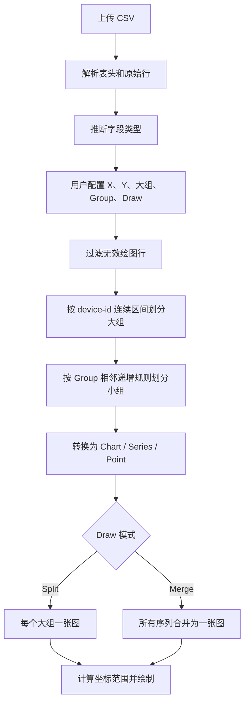

# CSV 多分组折线图开发文档

## 1. 文档目的

本文档用于指导 CSV 多分组折线图功能的设计、开发和测试。

功能目标：用户上传 CSV 文件后，系统解析表头和数据，并允许用户配置 X 轴、Y 轴、大组字段、Group 字段以及绘制模式，最终生成一张或多张折线图。

本文档中的分组规则以当前确认的业务规则为准：

- `device-id` 等专用字段负责划分大组。
- `Group` 负责在大组内部划分小组。
- 同一大组内，Group 任意字段相对上一行变小，或者所有 Group 字段完全重复时，创建新小组。
- 触发分组的当前行作为新小组的第一个数据点，不删除、不移动。

---

## 2. 功能范围

### 2.1 本期功能

1. 上传并解析 CSV 文件。
2. 解析 CSV 表头并识别数值列。
3. 配置 X 轴、Y 轴、大组字段和 Group 字段。
4. 支持无 X 轴时使用数据下标作为横坐标。
5. 支持 Merge 合并绘制和 Split 分图绘制。
6. 根据大组和小组规则正确生成折线序列。
7. 支持点击图表标题进行修改。
8. 坐标轴根据当前数据的最小值和最大值自动确定范围。
9. 支持数据点 Tooltip。
10. Content 区域支持多图滚动展示。
11. 展示 CSV 解析错误和无效数据统计。

### 2.2 暂不包含

1. 修改并回写原始 CSV 文件。
2. 服务端上传和持久化。
3. 多文件同时对比。
4. 用户手工拖动数据点。
5. 复杂数据清洗和缺失值插值。
6. 图表导出、配置模板保存等扩展功能。

---

## 3. 概念定义

### 3.1 大组（Big Group）

大组由一列专用字段划分，推荐字段名为 `device-id`。

系统按照 CSV 原始顺序逐行处理。当当前行的大组字段值与上一行不同时，结束上一个大组并创建新大组。

```text
currentDeviceId !== previousDeviceId
```

大组采用连续区间分组，不使用全局 `groupBy(device-id)`。这样可以保留 CSV 原始扫描顺序。

如果相同 `device-id` 在文件后面再次出现，应视为新的大组区间，而不是自动合并到前面的区间。可以使用内部 `bigGroupIndex` 区分同值的大组实例。

### 3.2 小组（Small Group）

小组是大组内部的一条折线序列，由用户选择的一个或多个 Group 字段决定。

例如：

```text
Group = [VWL, VBL]
```

每一行对应一个 Group 数值组合：

```text
(VWL, VBL)
```

系统只比较当前行和上一行，不检查更早的历史数据，也不使用历史分组起点进行判断。

### 3.3 绘制模式（Draw Mode）

- `merge`：所有大组的小组折线合并到一张图。
- `split`：每个大组生成一张图，大组内部的小组生成多条折线。

---

## 4. 页面设计

页面分为 Header 和 Content 两个区域。

```text
┌──────────────────────────────────────────────────────────────┐
│ 上传 CSV   filename.csv   658 行   解析状态                   │
├──────────────────────────────────────────────────────────────┤
│ X轴 [VBL ▼]   Y轴 [Current ▼]*   大组 [device-id ▼]         │
│ Group [VWL ×][VBL ×]       Draw [分图 | 合并]        [Draw]   │
└──────────────────────────────────────────────────────────────┘

┌──────────────────── Content，可滚动 ─────────────────────────┐
│ ┌─ device-id=121-5  ✎ ────────────────────────────────────┐  │
│ │                     折线图                              │  │
│ └─────────────────────────────────────────────────────────┘  │
│ ┌─ device-id=121-6  ✎ ────────────────────────────────────┐  │
│ │                     折线图                              │  │
│ └─────────────────────────────────────────────────────────┘  │
└──────────────────────────────────────────────────────────────┘
```

### 4.1 Header

Header 包含：

| 配置项 | 是否必选 | 说明 |
|---|---:|---|
| CSV 文件 | 是 | 上传本地 CSV 文件 |
| X 轴 | 否 | 下拉展示全部原始表头；不选择时使用小组内的数据下标 |
| Y 轴 | 是 | 下拉展示全部原始表头；点击 Draw 时校验数值转换 |
| 大组 | 否 | CSV 必须包含 `DeviceID` 列（解析时强制校验，作为大组字段）；配置中不选择时整个文件作为一个大组 |
| Group | 否 | 下拉展示全部原始表头，多选且有顺序；不选择时每个大组只有一个小组 |
| Draw | 是 | `merge` 或 `split` |
| Draw 按钮 | 是 | 校验当前配置，根据配置处理数据并绘图 |

推荐行为：

- 自动识别 `device-id`、`deviceId`、`Device ID` 等常见大组字段名。
- X 轴默认使用 `Index`，避免错误推断扫描列。
- Y 轴默认不选择，必须由用户确认。
- Group 使用可排序多选框，选中字段的顺序需要保留。
- Header 固定，Content 独立滚动。
- 上传完成后只解析文件和展示配置，不自动绘图。
- 修改配置不会立即影响现有图表，只有点击 Draw 后才应用配置。

### 4.2 Content

- Split 模式下，每个大组显示一个图表卡片。
- Merge 模式下，只显示一个图表卡片。
- 每张图建议高度为 `360px`。
- 宽屏可以使用两列布局，窄屏使用单列布局。
- 数据量较大时，可考虑只初始化可视区域附近的图表。

---

## 5. 配置模型

```ts
type DrawMode = 'merge' | 'split';

interface LineChartConfig {
  xColumn: string | null;
  yColumn: string;
  deviceColumn: string | null;
  groupColumns: string[];
  drawMode: DrawMode;
}
```

字段说明：

- `xColumn = null`：使用当前小组内从 `0` 开始的数据下标作为 X 值。
- `yColumn`：必选，必须为数值列。
- `deviceColumn = null`：所有有效数据属于同一个大组。
- `groupColumns = []`：当前大组的所有有效数据属于同一个小组。
- `groupColumns` 的顺序与 UI 中选择顺序一致。

---

## 6. CSV 数据模型

### 6.1 表头模型

CSV 原始表头需要保留，同时解析显示名（去掉括号中的单位文本，单位本身不再单独存储）。

```ts
interface CsvColumn {
  rawName: string;
  displayName: string;
  inferredType: 'number' | 'string' | 'mixed';
}
```

例如：

```ts
{
  rawName: 'Current(uA)',
  displayName: 'Current',
  inferredType: 'number',
}
```

### 6.2 行模型

每行是一个普通对象，键为 CSV 原始表头，值为字符串（`header:true` 解析，不做类型转换）。

```ts
type ParsedCsvRow = Record<string, string>;
```

例如：

```ts
{
  'DeviceID': '121-5',
  'VWL(V)': '1.60',
  'VBL(V)': '3.50',
  'Current(uA)': '0.3455',
}
```

Tooltip 通过行在 `rows` 数组中的下标（`ChartPoint.rowIndex`）反查原始行，原始表头即键名。

### 6.3 图表数据模型

```ts
interface ChartPoint {
  x: number;
  y: number;
  rowIndex: number;
}
```

`rowIndex` 是该行在 `rows` 数组中的下标，供 Tooltip 反查原始行（`rows[data[2]]`），不携带行内容引用。

```ts
interface ChartSeriesData {
  id: string;
  name: string;
  smallGroupIndex: number;
  points: ChartPoint[];
}

interface ChartGroupData {
  id: string;
  deviceValue: string;
  bigGroupIndex: number;
  title: string;
  series: ChartSeriesData[];
}
```

---

## 7. 大组划分算法

### 7.1 规则

1. 按 CSV 原始顺序逐行处理。
2. 第一条有效数据创建第一个大组。
3. 未配置大组字段时，所有数据属于同一个大组。
4. 配置大组字段后，当前值与上一行值不同时创建新大组。
5. 创建新大组时，小组状态必须完全重置。
6. 当前行作为新大组中第一个小组的第一个点。

### 7.2 伪代码

```ts
function isNewBigGroup(
  previousRow: ParsedCsvRow | null,
  currentRow: ParsedCsvRow,
  deviceColumn: string | null,
): boolean {
  if (!previousRow) {
    return true;
  }

  if (!deviceColumn) {
    return false;
  }

  return currentRow[deviceColumn] !==
    previousRow[deviceColumn];
}
```

### 7.3 现有样例兼容

虚拟大组字段已删除：解析时强制要求 CSV 必须包含 `DeviceID` 列（见 §13），不再在适配层生成虚拟 `device-id`。正式样例 `2.csv`、`3.csv`、`RESET.csv`、`SET.csv` 均包含 `DeviceID` 列。

---

## 8. 小组划分算法

### 8.1 最终业务规则

在同一个大组内，依次比较当前行和上一行的所有 Group 字段。

满足以下任意条件时创建新小组：

1. 任意一个 Group 字段的当前数值小于上一行数值。
2. 所有 Group 字段的当前数值与上一行完全相等。

除此之外，当前行继续加入现有小组。

重要约束：

- 比较方式不是字符串比较或字典序比较。
- 每个 Group 字段都需要单独进行数值比较。
- 只比较相邻两行。
- 不检查当前组合是否在更早的数据中出现过。
- 不记录历史分组起点。
- 触发分组的当前行必须作为新小组的第一个点。
- 完全重复的数据点不能去重，即使新小组最终只有一个点也需要保留。

### 8.2 判断函数

```ts
function shouldStartNewSmallGroup(
  previousValues: number[],
  currentValues: number[],
): boolean {
  const hasDecrease = currentValues.some(
    (value, index) => value < previousValues[index],
  );

  const isExactRepeat = currentValues.every(
    (value, index) => value === previousValues[index],
  );

  return hasDecrease || isExactRepeat;
}
```

### 8.3 判断表

| Group 数据变化 | 处理结果 |
|---|---|
| 所有列递增 | 继续当前小组 |
| 部分列相等，其余列递增 | 继续当前小组 |
| 任意一列变小 | 创建新小组 |
| 所有列完全相等 | 创建新小组 |
| 一列变大、另一列变小 | 创建新小组 |

### 8.4 单列示例

当 `Group = [VBL]`：

```text
输入：
1.00
1.05
1.10
1.15
1.15
1.00
1.05

输出：
Group 1：1.00, 1.05, 1.10, 1.15
Group 2：1.15
Group 3：1.00, 1.05
```

原因：

- 第二个 `1.15` 与上一行完全相同，创建 Group 2。
- `1.00 < 1.15`，创建 Group 3。
- `1.05 > 1.00`，继续 Group 3。

### 8.5 多列示例

当 `Group = [VWL, VBL]`：

```text
Group 1：
(1.60, 3.00)
(1.60, 3.50)
(1.60, 4.00)

Group 2：
(1.60, 2.50)
(1.60, 3.00)
(1.60, 3.50)
(1.60, 4.00)

Group 3：
(1.60, 3.00)
(1.60, 3.50)
(1.60, 4.00)

Group 4：
(1.70, 3.00)
(1.70, 3.50)
(1.70, 4.00)
```

边界解释：

- Group 1 到 Group 2：`VBL` 从 `4.00` 变为 `2.50`，创建新组。
- Group 2 内部：`2.50 -> 3.00 -> 3.50 -> 4.00` 持续递增，保持在同一组。
- Group 2 到 Group 3：`VBL` 从 `4.00` 变为 `3.00`，创建新组。
- Group 3 到 Group 4：`VWL` 变大，但 `VBL` 从 `4.00` 变为 `3.00`；因为任意一列变小，所以创建新组。

### 8.6 完整分组伪代码

```ts
function buildChartGroups(
  rows: ParsedCsvRow[],
  config: LineChartConfig,
): ChartGroupData[] {
  const chartGroups: ChartGroupData[] = [];

  let previousRow: ParsedCsvRow | null = null;
  let currentBigGroup: ChartGroupData | null = null;
  let currentSeries: ChartSeriesData | null = null;

  for (const row of rows) {
    if (!isValidChartRow(row, config)) {
      continue;
    }

    const bigGroupChanged = isNewBigGroup(
      previousRow,
      row,
      config.deviceColumn,
    );

    if (bigGroupChanged) {
      currentBigGroup = createBigGroup(row, config);
      currentSeries = createSmallGroup(currentBigGroup);
      chartGroups.push(currentBigGroup);
    } else if (
      currentBigGroup &&
      currentSeries &&
      config.groupColumns.length > 0 &&
      previousRow
    ) {
      const previousValues = getNumericGroupValues(
        previousRow,
        config.groupColumns,
      );

      const currentValues = getNumericGroupValues(
        row,
        config.groupColumns,
      );

      if (
        shouldStartNewSmallGroup(
          previousValues,
          currentValues,
        )
      ) {
        currentSeries = createSmallGroup(currentBigGroup);
      }
    }

    currentSeries?.points.push(createChartPoint(row, config));
    previousRow = row;
  }

  return chartGroups;
}
```

注意：实际实现中，无效行不能错误地参与相邻比较。`previousRow` 应指向上一条有效绘图数据，而不是上一条原始 CSV 数据。

---

## 9. X 轴与 Y 轴

### 9.1 X 轴

- 用户选择 X 字段时，将该字段转换为有限数字。
- 用户不选择 X 字段时，每个小组使用局部数据下标：`0, 1, 2, ...`。
- 不对 X 数据进行排序，折线连接顺序必须与 CSV 原始顺序一致。

### 9.2 Y 轴

- Y 轴必选。
- 只允许选择可转换为数字的列。
- `NaN`、空字符串、`Infinity` 等无效值不参与绘图。
- 页面需要展示跳过的数据行数量和原因。

### 9.3 坐标轴范围

每张图根据实际包含的数据独立计算范围：

```text
xMin = 所有有效 X 的最小值
xMax = 所有有效 X 的最大值
yMin = 所有有效 Y 的最小值
yMax = 所有有效 Y 的最大值
```

要求：

- 坐标轴不强制从 `0` 开始。
- 默认以数据最小值和最大值作为边界。
- 刻度由 ECharts 根据范围自动计算，目标刻度数量建议为 5～8 个。
- 刻度应当自适应且可复现，不应使用真正的随机数。
- 当最小值等于最大值时，需要增加一个小范围，避免坐标轴无法展开。

常量数据建议范围：

```ts
const padding = Math.abs(value) > 0
  ? Math.abs(value) * 0.05
  : 1;

const min = value - padding;
const max = value + padding;
```

### 9.4 Merge 与 Split 的范围

- Merge：根据合并后所有序列计算统一范围。
- Split：每张大组图独立计算范围。

---

## 10. 图表绘制

项目已经包含 ECharts，折线图继续使用 ECharts 实现。

### 10.1 Series

每个小组对应一个 ECharts `line` series：

```ts
{
  type: 'line',
  name: seriesName,
  data: points.map((point) => [point.x, point.y]),
  showSymbol: true,
  connectNulls: false,
}
```

需要保留单点小组。单点小组虽然没有线段，但必须显示 Symbol。

### 10.2 Series 名称

Split 模式建议：

```text
Group 1
Group 2
Group 3
```

Merge 模式必须带上大组信息，避免重名：

```text
device-id=121-5 / Group 1
device-id=121-5 / Group 2
device-id=121-6 / Group 1
```

### 10.3 Tooltip

Tooltip 至少展示：

```text
device-id: 121-5
Group: 2
VWL: 1.60 V
VBL: 3.50 V
Current: 0.3455 uA
Mode: SET_SWEEP
```

建议使用：

- `trigger: 'axis'` 或按产品体验选择 `trigger: 'item'`。
- `axisPointer.type: 'cross'`。
- 数值展示保留合理有效位数，原始值仍保存在数据对象中。

---

## 11. Draw 模式

### 11.1 Split 分图

每个大组生成一张图，每个小组生成图内的一条折线。

```text
device-id=121-5 -> Chart 1
device-id=121-6 -> Chart 2
device-id=121-7 -> Chart 3
```

默认标题：

```text
device-id=121-5
```

### 11.2 Merge 合并

所有大组的小组序列放入同一张图。

要求：

- Series 名称包含大组值和小组序号。
- 图例支持滚动，避免序列过多时占满页面。
- Tooltip 中必须明确显示大组和小组信息。

---

## 12. 图表标题编辑

图表标题由 React 组件管理，不依赖 ECharts 内部标题点击事件。

交互规则：

1. 单击标题或编辑图标进入编辑状态。
2. `Enter` 保存。
3. `Esc` 取消。
4. 失焦保存。
5. 空标题恢复默认标题或提示用户输入。
6. 自定义标题以 `ChartGroupData.id` 为 Key 保存在当前页面状态中。
7. 修改显示配置后，只要大组 ID 未变化，自定义标题不丢失。

Merge 模式只有一个标题，默认可以使用 CSV 文件名。

---

## 13. CSV 解析与校验

### 13.1 解析要求

- 支持 UTF-8 BOM。
- 支持带引号字段、逗号转义、空字段和不同换行符。
- 不建议使用简单的 `string.split(',')`。
- 使用成熟 CSV 解析库（当前为 papaparse，`header:true`，行对象以原始表头为键）。
- 保留原始表头，不直接修改用户数据。
- 解析校验顺序：文件为空 → 无表头 → 空表头 → 重复表头 → 缺少 `DeviceID` 列 → papaparse 错误统一报 `CSV 解析出错`。

### 13.2 类型推断

- 对每一列抽样或遍历有效值，判断 `number`、`string` 或 `mixed`。
- X、Y 和 Group 字段必须能够转换为有限数字。
- 大组字段允许字符串或数字。

### 13.3 无效数据

以下数据不能参与绘图或 Group 数值比较：

- X 字段为空或无法转换为有限数字。
- Y 字段为空或无法转换为有限数字。
- 任意 Group 字段为空或无法转换为有限数字。
- 大组字段缺失。

解析结果需要提供统计（`BuildChartResult`）：

```ts
interface BuildChartResult {
  validRows: number;
  skippedRows: number;
  errors: Array<{
    message: string;
  }>;
}
```

错误明细不再携带原始行号；错误过多时，界面只展示前若干条明细和总数。

---

## 14. 数据处理流程



---

## 15. 当前模块拆分

```text
src/webview/components/line-chart/
├── index.ts
├── LineChartWorkbench.tsx
├── types.ts
├── styles.module.scss
├── components/
│   ├── CsvUploadPanel.tsx
│   ├── ChartConfigPanel.tsx
│   ├── ChartFeedback.tsx
│   ├── ChartContent.tsx
│   ├── ChartCard.tsx
│   └── EditableChartTitle.tsx
├── hooks/
│   ├── useCsvUpload.ts
│   └── useLazyECharts.ts
├── utils/
│   ├── csv-parser.ts
│   ├── data-adapter.ts
│   ├── config-validator.ts
│   ├── group-builder.ts
│   ├── chart-option-builder.ts
│   ├── chart-style.ts
│   └── axis-range.ts
└── 开发文档.md
```

职责：

- `csv-parser.ts`：CSV 文本解析、BOM 处理和表头校验（含 DeviceID 强制校验）。
- `data-adapter.ts`：大组字段识别（`findDeviceColumn`）。
- `config-validator.ts`：默认配置生成和绘图配置校验。
- `group-builder.ts`：大组、小组和数据点构建，不包含 React 或 ECharts 代码。
- `axis-range.ts`：坐标轴最小值、最大值和常量范围处理。
- `chart-option-builder.ts`：将标准图表数据转换为 ECharts Option。
- `useCsvUpload.ts`：文件读取、CSV 解析和上传状态管理。
- `useLazyECharts.ts`：ECharts 初始化、懒加载、Resize 和销毁。
- `styles.module.scss`：模块化样式，类名统一使用下划线拼接。
- React 组件只负责交互和渲染，不直接实现解析、校验或分组算法。

---

## 16. 性能要求

当前样例为数百行，ECharts 可以直接处理。实现仍需避免不必要的重复计算：

- CSV 解析结果使用 `useMemo` 或独立状态缓存。
- 只有文件或绘图配置变化时重新执行分组。
- 标题编辑不重新解析 CSV。
- Resize 使用 `ResizeObserver`，避免频繁全局监听。
- 组件卸载时执行 `chart.dispose()`。
- 多图较多时可以按需增加懒初始化或虚拟滚动。

---

## 17. 测试方案

### 17.1 大组测试

1. 未配置大组字段时只有一个大组。
2. `device-id` 从 `1` 变为 `2` 时创建新大组。
3. 相同 `device-id` 连续数据保持在同一大组。
4. 相同 `device-id` 非连续再次出现时创建新的大组实例。
5. 大组切换后，小组编号从 1 重新开始。

### 17.2 单列 Group 测试

输入：

```text
1.00, 1.05, 1.10, 1.15, 1.15, 1.00, 1.05
```

期望：

```text
[1.00, 1.05, 1.10, 1.15]
[1.15]
[1.00, 1.05]
```

### 17.3 多列 Group 测试

输入：

```text
(1.60, 3.00)
(1.60, 3.50)
(1.60, 4.00)
(1.60, 2.50)
(1.60, 3.00)
(1.60, 3.50)
(1.60, 4.00)
(1.60, 3.00)
(1.60, 3.50)
(1.60, 4.00)
(1.70, 3.00)
(1.70, 3.50)
(1.70, 4.00)
```

期望生成四个小组：

```text
Group 1: 前 3 行
Group 2: 接下来 4 行
Group 3: 接下来 3 行
Group 4: 最后 3 行
```

### 17.4 边界测试

1. Group 所有字段完全重复时，当前行成为新小组第一行。
2. 一列变大、一列变小时创建新小组。
3. 一列相等、另一列变大时继续当前小组。
4. 单点小组能够绘制 Symbol。
5. X/Y 为负数时坐标轴不从 0 开始。
6. X 或 Y 全部相同时坐标轴可以正常展开。
7. 无效 Group 数值不会参与相邻比较。
8. 空 CSV、只有表头的 CSV、重复表头、缺少 `DeviceID` 列需要给出明确提示。

### 17.5 图表交互测试

1. Tooltip 显示正确的原始行数据。
2. Split 模式图表数量等于大组数量。
3. Merge 模式只有一张图，Series 数量等于全部小组数量。
4. 点击标题后可以保存和取消修改。
5. Content 多图时可以滚动。
6. 容器尺寸变化后图表正确 Resize。

---

## 18. 验收标准

功能验收需要同时满足：

1. 上传 CSV 后能展示正确表头。
2. Y 轴未选择时禁止绘制并给出提示。
3. 无 X 轴时使用小组内部 Index 正确绘制。
4. `device-id` 改变时正确生成新大组。
5. Group 任意列变小时正确生成新小组。
6. Group 所有列完全重复时正确生成新小组。
7. 触发分组的当前行没有被丢弃。
8. 单点小组可以在图中看到数据点。
9. Merge 和 Split 模式结果符合定义。
10. 图表坐标范围来自真实数据，而不是固定从 `0` 开始。
11. Tooltip 能对应到正确的 CSV 原始行。
12. 图表标题可以点击修改。
13. 多个大组图可以在 Content 区域正常滚动查看。
14. `2.csv`、`3.csv`、`RESET.csv`、`SET.csv` 均能通过对应配置正确绘制。

---

## 19. 推荐开发顺序

1. 定义配置、CSV 行、Chart、Series 和 Point 类型。
2. 实现 CSV 解析和字段类型推断。
3. 实现并单元测试大组划分。
4. 实现并单元测试小组划分。
5. 实现标准图表数据转换。
6. 实现 ECharts Option 和坐标范围计算。
7. 实现 Header 配置区域。
8. 实现 Split 和 Merge Content。
9. 实现标题编辑、Tooltip 和滚动布局。
10. 使用四份样例 CSV 进行集成验证。

分组算法属于本功能最关键的业务逻辑，应优先完成独立单元测试，再接入页面和 ECharts。
